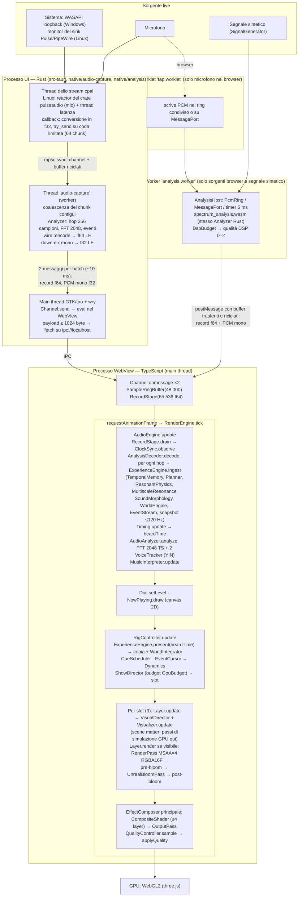

# Euforia Engine — Full Internal Technical & Performance Audit

Commit `2a8dfde` (`main`) · 9 ottobre 2026 · solo analisi: nessuna modifica al codice dell'applicazione, nessun commit, nessun push.

## 1. Executive Summary

**Domanda.** Perché l'applicazione desktop mostra micro-lag e scatti, sia subito sia dopo alcuni minuti.

**Risposta breve.** Nella configurazione dell'utente (microfono, scena Tunnel, qualità High) l'istanza desktop di prova ha reso 21–23 fotogrammi al secondo, con il 21–30 % dei frame oltre 50 ms. Le cause sono più d'una e si sommano; la più pesante durante l'audit non è nel software.

1. **La macchina di prova era limitata a 800 MHz.** Un limite di potenza di 7 W teneva la CPU a un sesto della frequenza massima, senza surriscaldamento; l'alimentazione era USB-C da 15 W. Ogni lavoro CPU durava 6–10 volte il normale, e nessuna configurazione ha raggiunto 60 fps, nemmeno la più leggera. A fine audit, a batteria piena, il limite è salito a 12 W e la stessa scena a Low, in Chromium, è passata da 40 a 59,5 fps. Quasi tutti i tempi assoluti di questo report descrivono lo stato a 7 W.
2. **Il main thread fa quasi tutto, e la voce più grande è l'analisi grafica.** FFT e tracciamento delle voci in TypeScript girano a ogni frame per qualunque scena e valgono il 55 % della CPU del frame. L'intera catena musicale (Experience, Planner, fisica, mondo, regia) vale il 5–15 %: non è lei il problema.
3. **A Medium e High la GPU integrata non sta nel budget.** Il tempo GPU per frame è 1–6 ms a Low, 15–30 ms a Medium e 24–67 ms a High già a 1280×720. Il bloom vale 7–9 ms; il resto è antialiasing ×4 su target a 16 bit e numero di pixel.
4. **La cattura nativa disturba il thread che disegna.** I dati arrivano con 100–200 messaggi IPC al secondo; a parità di tutto il resto le code del frame time sono circa doppie rispetto al percorso con worker (p99 111–135 ms contro 59–73 ms).
5. **Con la cattura nativa l'orologio del moto scatta.** La stima che lega il tempo audio al tempo video salta di 2,5–14 ms da 0,4 a 1,6 volte al secondo. È la spiegazione più diretta di un moto «a strappi» anche quando i frame arrivano puntuali.
6. **Nella build di sviluppo su Linux una dipendenza audio brucia un core** e blocca il cambio sorgente per minuti: durante l'audit l'utente ha cambiato sorgente e la sua applicazione è rimasta circa 20 minuti senza audio. Causa isolata e correzione dimostrata con un esperimento; non è però la causa del frame rate basso.

**Cosa non è emerso.** Nessuna perdita di memoria, nessuna struttura che cresce, nessun degrado progressivo dell'applicazione in 10 minuti di sessione controllata e in un'ora di osservazione della sessione reale dell'utente, attiva da 25 ore. L'unico cambiamento «dopo alcuni minuti» osservato è della macchina: a parità di lavoro il costo del frame raddoppia o si dimezza, con ogni probabilità insieme al limite di potenza, che segue la carica della batteria.

**Limiti da tenere presenti.** Le misure sono state prese con l'applicazione dell'utente in esecuzione sulla stessa macchina, senza build di release e senza Windows, che è la piattaforma di destinazione. La diagnostica integrata non è sufficiente a trovare queste cause: nel WebView non misura il tempo GPU e non osserva né il trasporto né l'orologio.

**Primo passo consigliato.** Rimisurare la configurazione dell'utente a macchina correttamente alimentata, con una sola istanza e in release (esperimenti E-01 ed E-02, §17). Quel dato stabilisce quanta parte del sintomo sparisce da sola e l'ordine degli interventi successivi (§16).

| Classe | Numero | Dove |
|---|---:|---|
| Criticità confermate | 15 | §13, A-01 … A-15 |
| Probabili | 8 | §13, L-01 … L-08 |
| Ipotesi | 6 | §13, H-01 … H-06 |

## 2. Versione e configurazione esaminata

| Voce | Valore |
|---|---|
| Repository | `lonelyfrank/euforia-audio-experience` |
| Branch / commit | `main` @ `2a8dfde92617f13a8f2a9ae035f4408c780457e7` (allineato a `origin/main`, albero pulito all'inizio dell'audit) |
| Data dell'audit | 9 ottobre 2026, misure fra le 16:20 e le 18:10 (ora locale) |
| Frontend | TypeScript 6.0.3 strict, DOM vanilla, three 0.186.1, Vite 8.3.1, Vitest 5.0.2, @tauri-apps/api 2.11.1 |
| Desktop | Tauri 2.11.6, wry 0.55.1, tao 0.35.3, tauri-runtime-wry 2.11.4, crate `webkit2gtk` 2.0.2 |
| Audio nativo | cpal 0.18.2 (Linux: feature `pulseaudio`), crate `pulseaudio` 0.3.1, mio 1.2.3, futures 0.3.34 |
| Toolchain | rustc/cargo 1.98.1 (Fedora), Node 22.23.1 |
| Dimensioni (senza test) | TS: ~24.700 righe in 16 aree (`visual-engine` 4.981, `audio` 4.315, `render-systems` 3.391, `visualizers` 3.389, …); Rust: `native/analysis` 4.027, `native/audio-capture` 502, `src-tauri` 187, `analysis-wasm` 99; 58 file di test, 9.186 righe |

### Macchina di prova

| Voce | Valore osservato |
|---|---|
| Sistema | Fedora Linux 44, kernel 7.2.8, GNOME su Wayland |
| CPU | Intel Core i7-10510U (4 core / 8 thread), `intel_pstate` attivo, governor `powersave`, EPP `balance_performance`, profilo tuned `balanced` |
| **Stato della CPU durante le misure** | **frequenza 700–800 MHz su tutti i core** (massimo 4.900 MHz) con load average 11–14; temperatura package 58–59 °C; contatori di thermal throttling a 0 |
| Limite di potenza | `intel-rapl-mmio:0` PL1 = **7 W** (finestra 28 s), PL2 51 W; `intel-rapl:0` (MSR) PL1 = 51 W. Il limite efficace è il minore |
| **Stato a fine audit (18:07)** | batteria al 100 %, non più in carica: PL1 = **12 W**, frequenza **1.500–1.600 MHz**. Il limite segue lo stato di carica |
| Alimentazione | USB-C Power Delivery a **5 V × 3 A (15 W)**, batteria al 79 % in carica |
| GPU | Intel UHD Graphics CML GT2 (`0x9b41`), Mesa 26.2.3, driver i915; condivide il budget di potenza del package |
| Display | eDP 1920×1080 a 60 Hz, scala 1 (`devicePixelRatio` = 1 nel WebView) |
| WebView | WebKitGTK 2.54.0 (`webkit2gtk4.1-2.54.0-2.fc44`), UA `AppleWebKit/605.1.15 … Version/60.5 Safari/605.1.15`; WebGL 2.0 nel WebProcess (nessun `WebKitGPUProcess`); renderer mascherato come «Apple GPU»; `EXT_disjoint_timer_query_webgl2` **assente**; `crossOriginIsolated` = false |
| Audio | PipeWire 1.6.9 con `pipewire-pulse`; sink predefinito altoparlante interno, sorgente predefinita microfono digitale |

Il valore di 7 W spiega la frequenza: non è surriscaldamento. Il limite non è fisso: con la batteria in carica vale 7 W, a batteria piena 12 W, sempre con la stessa alimentazione da 15 W. A 7 W **ogni lavoro CPU dura fra 6 e 10 volte più del nominale** (nucleo YIN di riferimento 7,1 ns per iterazione in WebKit e 8–15 ns in Chromium, contro circa 1 ns atteso a piena frequenza); a 12 W circa la metà (§12.1, §12.9). Quasi tutte le serie sono state prese nello stato a 7 W.

### Configurazione dell'utente

Letta in sola lettura dal `localStorage` dell'applicazione desktop dell'utente (`~/.local/share/dev.euforia-audio-experience.app/localstorage/http_localhost_1420.localstorage`):

```json
{"source":"microphone","scene":"tunnel","quality":"high","reflection":false,"audioDelay":55,
 "rigMode":"preset","direction":"manual","mood":"focus","experience":"reactive","trackInfo":"dim",
 "sensitivity":1,"smoothing":0.55,"beatResponse":true,"reduceFlashing":false,"preset":"nebula"}
```

Quindi: cattura nativa dal microfono, una sola scena (Tunnel) come disegnata, qualità **High fissa** (non Auto), nessun riflesso. Qualità Auto e regia multi-scena non sono in gioco nella sessione dell'utente; sono state comunque provate.

Lettura delle 16:25. Alle 17:22:31 l'utente ha cambiato sorgente (audio di sistema) e scena (Matter Field), lasciando invariato il resto; l'effetto di quel cambio sulla sua sessione è in §12.2.

### Sessione reale dell'utente osservata

Il processo `target/debug/euforia-audio-experience` (PID 224903, avviato l'8 ottobre alle 14:50 con `tauri dev`, binario del 7 ottobre) era in esecuzione durante l'audit, da oltre 25 ore. È stato osservato dall'esterno, senza modificarlo (§12.2).

## 3. Metodologia e limiti della verifica

### Cosa è stato fatto

1. **Analisi statica** del codice a `2a8dfde`: percorso audio dal callback cpal ai uniform delle scene, proprietà e lifecycle, strutture a crescita, operazioni per frame e per hop. README e schede in `docs/` usati come indice, mai come prova.
2. **Osservazione passiva della sessione reale dell'utente**: CPU per thread (`/proc/<pid>/task/*/stat`), memoria (`/proc/<pid>/status`), tempo del motore di rendering GPU per client DRM (`/proc/<pid>/fdinfo`, driver i915), ogni 20 s per oltre un'ora; campioni di stack con `eu-stack` sul solo thread interessato.
3. **Istanza desktop Tauri isolata**, costruita dallo stesso commit in un worktree esterno al repository (`git worktree` nello scratchpad), con identificativo proprio (`dev.euforia-audio-experience.audit`), directory dati propria, `CARGO_TARGET_DIR` proprio e dev server su porta 1432. Le impostazioni salvate dell'utente non sono state toccate.
4. **Sonda temporanea** (`audit-probe.ts`, solo nel worktree): non cambia il codice del motore. A runtime avvolge sette metodi delle istanze vive per cronometrarli (`RenderEngine.tick`, `App.onFrame`, `AudioEngine.update`, `AudioAnalyzer.analyze`, `AnalysisDecoder.decode`, `RigController.update`, `ExperienceEngine.present`), registra intervalli RAF, hop decodificati per frame, avanzamento del clock udito e offset di `ClockSync`, pilota `settingsStore` come farebbe l'utente e usa il `DiagnosticsController` esistente per i contatori del renderer. La stessa sonda gira in Chromium headless.
5. **Segnale di prova sulla cattura nativa, in silenzio**: il segnale `synthPop` del generatore del progetto, scritto in WAV, riprodotto con `pw-play` senza auto-connessione e collegato con `pw-link` **solo** alle porte di ingresso dello stream di cattura dell'istanza di audit. Nessun sink creato, dispositivi predefiniti e stream dell'utente non toccati, nessun suono emesso.
6. **Esperimento isolato sulla build**: nel worktree, `[profile.dev.package.pulseaudio] opt-level = 3` (un solo crate ottimizzato, tutto il resto invariato).
7. **Chromium 1243 headless sulla GPU reale** (ANGLE → Mesa Intel UHD CML GT2), unico ambiente con query temporali GPU e `performance.memory`.
8. **Suite e benchmark esistenti**: benchmark di `src/bench`, `cargo test` del core (§12.10).

### Limiti dichiarati

- **Carico concorrente.** L'applicazione dell'utente è rimasta in esecuzione per tutta la durata (circa 2,6 core occupati e 42–65 % della GPU). Tutte le misure dell'istanza di audit e di Chromium sono state prese con quel carico in più: i valori assoluti sono peggiori di quelli che l'utente vede con una sola istanza. I confronti all'interno della stessa serie restano validi.
- **CPU a 800 MHz** (1,6 GHz nell'ultima prova). I tempi CPU assoluti descrivono questa macchina in questo stato, non l'hardware di riferimento. Le quote relative (chi pesa quanto dentro il frame) sono trasferibili; i millisecondi no.
- **Nessuna misura su Windows / WebView2 / WASAPI**, che è la piattaforma di destinazione. Tutto ciò che riguarda `pulseaudio`, WebKitGTK e PipeWire vale solo per Linux.
- **Nessuna build di release misurata.** L'esperimento sul singolo crate isola la causa del difetto A-06, ma il costo del processo UI in release (serializzazione e IPC ottimizzati) resta non misurato.
- **Tempo GPU non misurabile nel WebView** (estensione assente in WebKitGTK): il tempo GPU per frame viene da Chromium; nel desktop è disponibile solo l'occupazione del motore di rendering per processo.
- **Heap JavaScript non osservabile in WebKit** (`performance.memory` assente): allocazioni e GC sono misurati in Chromium; nel desktop solo RSS del processo e CPU dei thread `HeapHelper`.
- **Finestra a 1280×720** (canvas 1280×673) per l'istanza di audit; l'utente può usare la finestra a dimensione diversa o a schermo intero. Schermo intero non provato sul desktop (avrebbe coperto lo schermo dell'utente); 1920×1080 provato in Chromium.
- **Sessione prolungata di 10 minuti** (desktop) e 8 minuti (Chromium): sufficienti per vedere derive rapide, non per una crescita di memoria su ore.
- **Le riprove sono poche** (una o due per configurazione): i percentili alti vanno letti come ordine di grandezza.
- Download dei report e worker di replay della diagnostica **non provati** nel WebView.

### Tracciabilità

Ogni tabella cita la serie (`D` = build dev come quella dell'utente, `P` = build dev con il solo crate `pulseaudio` ottimizzato, `B` = Chromium). I dati grezzi sono allegati in `docs/audit-data/` (§12.12).

## 4. Diagramma architetturale effettivo

Ricostruito da chiamate, proprietà e thread osservati, non dal README.



Punti che il diagramma fissa e che differiscono da una lettura veloce della documentazione:

- **Il DSP Rust è fuori dal frame loop, tutto il resto no.** `ExperienceEngine.ingest` gira sul main thread del WebView, dentro `requestAnimationFrame`, una volta per hop (187,5 hop al secondo a 48 kHz, cioè circa 3 per frame a 60 fps e 9 a 21 fps). Con esso girano Planner, fisica risonante, risonanza multiscala, morfologia e World Engine.
- **Esistono due analisi spettrali.** Quella Rust per hop (musica) e quella TypeScript per frame (`AudioAnalyzer`, grafica delle scene), sullo stesso PCM. È una scelta dichiarata («due contratti distinti»), ma la seconda sta sul main thread.
- **Nel desktop il PCM attraversa l'IPC due volte in forma diversa**: come record di feature e come PCM mono per l'analisi grafica.
- **Il commento di testa di `src-tauri/src/lib.rs` è superato** («No analysis happens here; PCM is streamed as-is»): l'analisi gira nel backend (`src-tauri/src/audio.rs:113-168`).
- **Structural Dynamics non è nel percorso di prodotto**: `WirePolygonPrimitive` e `StructuralSystem` sono montati solo dallo Structural Lab (DEV). Del lavoro di quel filone, in produzione gira soltanto `MultiscaleResonance` per hop.

### Sistemi doppi, superati o non usati

| Elemento | Stato | Nota |
|---|---|---|
| `AudioAnalyzer` + `MusicInterpreter` / `MusicContext` (TS) accanto a DSP Rust + `ExperienceEngine` | entrambi vivi | due catene di interpretazione: le scene storiche leggono `response`/`music.*`, le recipe leggono `WorldView` e `GeometryState` |
| `ResonantFieldVisualizer.ts` accanto a `resonant-field/recipe.ts` | il primo solo con `?legacy=resonant-field` in DEV | codice di confronto, escluso dalla build |
| DebugOverlay, EngineCockpit, Diagnostics Dashboard | tre strumenti DEV | coordinati da `DiagnosticsController` |
| Ramo `number[]` in `NativeAudioCapture.ts:48` | mai percorso con Tauri 2.11 | i payload raw piccoli arrivano comunque come `ArrayBuffer` (`tauri-2.11.6/src/ipc/channel.rs:207-209`) |
| Audit storici in `docs/` | dichiarati storici in `AGENTS.md` | nessun impatto a runtime |

## 5. Stato della pipeline audio

### 5.1 Percorso completo, come implementato

| Stadio | Dove | Thread | Codice |
|---|---|---|---|
| Apertura del dispositivo | cpal; Linux: host PulseAudio, monitor del sink predefinito o microfono, buffer richiesto 10 ms | worker | `native/audio-capture/src/platform.rs:167-176`, `capture.rs:175-232` |
| Callback audio | conversione in `f32`, buffer riciclati, `try_send` su coda da 64 chunk (pieno → chunk perso, il contatore dei frame avanza) | thread dello stream | `capture.rs:195-221` |
| Coalescenza | unisce i chunk contigui in un batch; un vuoto diventa `gap` | `audio-capture` | `capture.rs:122-163` |
| DSP | `Analyzer::push`: anello PCM, hop 256 campioni, FFT 2048, ritmo, armonia, HPSS, loudness, struttura; nessuna allocazione per hop (tutti i buffer nascono nel costruttore) | `audio-capture` | `native/analysis/src/analyzer.rs:224-260` |
| Qualità DSP adattiva | carico > 0,3 per 2 s → qualità +1 (max 2); < 0,12 per 30 s → −1; cambia solo le cadenze lente | `audio-capture` | `src-tauri/src/audio.rs:146-161` |
| Codifica | record `f64` little-endian: frame 343 valori (2.744 byte), onset 6, beat 9, sezione 9, clock 3 | `audio-capture` | `audio.rs:113-168`, `native/analysis/src/wire.rs` |
| Trasporto | due `Channel` Tauri per batch: record e PCM mono `f32` | main thread UI → WebView | `audio.rs:63-73` |
| Ricezione | `Channel.onmessage`: PCM in `SampleRingBuffer(48000)`, record in `RecordStage(65536)` con l'istante di arrivo | main thread WebView | `src/audio/capture/NativeAudioCapture.ts:45-56` |
| Lettura per frame | `readSamples` (4.096 campioni), `RecordStage.drain` → `ClockSync.observe` e `AnalysisDecoder.decode` | RAF | `src/audio/AudioEngine.ts:155-171` |
| Interpretazione | per ogni hop decodificato → `ExperienceEngine.ingest`; onset, beat e sezioni → `EventStream` | RAF | `src/audio/AudioEngine.ts:39-42`, `src/experience/ExperienceEngine.ts:85-184` |
| Timing | `heardTime = ClockSync.toCapture(now + 1,5 frame − latenza d'uscita)` | RAF | `src/timing/Timing.ts:115-134` |
| Analisi grafica | `AudioAnalyzer.analyze`: FFT 2048 in TS, bande, flux, due `VoiceTracker` (YIN) | RAF | `src/audio/AudioEngine.ts:168`, `src/audio/analysis/VoiceTracker.ts:119-165` |
| Rig | `ExperienceEngine.present(heardTime)`, cue, eventi, ShowDirector, Dynamics | RAF | `src/app/RigController.ts:89-117` |
| Scene | `Layer.update` → `Visualizer.update` con `AudioFrame`, `MusicState`, `SceneClock` | RAF | `src/renderer/Layer.ts:106-128` |

Nel browser (e nel desktop con il segnale sintetico) i primi cinque stadi sono sostituiti da `analysis.worker.ts`: stesso `Analyzer` compilato in WASM, batch consegnati con `postMessage` e buffer trasferiti e riciclati (`src/audio/features/BrowserAnalysis.ts:151-175`).

### 5.2 Misure

Valori dell'istanza desktop di audit, 1280×673, scena Tunnel, CPU a 800 MHz, applicazione dell'utente attiva in parallelo.

| Grandezza | Valore | Origine |
|---|---|---|
| Sample rate effettivo | 48.000 Hz per sistema, microfono e sintetico | `AudioEngine.captureSampleRate` |
| Dimensione del buffer richiesto (Linux) | 480 frame = 10 ms | `platform.rs:171` |
| Hop decodificati | 186,9–190,4 al secondo (nominale 187,5) | sonda, tutte le serie |
| Volume dei dati | feature ≈ 514 kB/s, PCM mono ≈ 192 kB/s | 187,5 × 2.744 byte; 48.000 × 4 byte |
| Messaggi IPC ≥ 1024 byte (fetch su `ipc://localhost`) | **99,5/s** nella build dev (serie D), **192/s** con il reactor ottimizzato (serie P) | sonda: conteggio di `fetch` |
| Hop decodificati in un solo frame | mediana ≈ 8 a 21–23 fps; **massimo 34–58** nelle serie brevi, **93** nella sessione di 10 minuti | sonda |
| Record scartati da `RecordStage` | 0 nelle serie brevi; **65.494 valori `f64`** (≈ 190 hop, ≈ 1 s di analisi) nella sessione di 10 minuti | `RecordStage.dropped` |
| Vuoti di cattura, riavvii dell'analisi | 0 (`ExperienceEngine.gaps`, sessione invariata) | sonda |
| Ritardo cattura → frame che ne viene a conoscenza | 0,08–0,24 s nativo; 0,044–0,052 s sintetico | `Timing.onsetDelay` |
| Anticipo del momento udito sull'analisi più recente | 0,006–0,19 s nativo; 0,009–0,057 s sintetico | `Timing.lead` |
| CPU dei thread di cattura (reactor + worker DSP) | **116 % di un core** nella build dev; **7,7 %** (finestra di 3 minuti) e 35,7 % (sessione di 10 minuti) con il reactor ottimizzato | `/proc/<pid>/task` |
| CPU del main thread del processo UI (invio IPC) | 29–45 % di un core | `/proc/<pid>/task` |
| DSP nel worker WASM (sintetico) | carico 0,18–0,34 con qualità DSP già scesa a 2; thread `WebCore: Worker` 35 % di un core | `RealtimeStats`, `/proc` |
| Decodifica + Experience sul main thread | 0,8–3,2 ms per frame (≈ 0,25 ms per hop) | sonda |
| Analisi grafica TS sul main thread | **7,9–10,9 ms per frame**, indipendente dalla scena | sonda |

Tutti i tempi CPU vanno divisi per un fattore 6–10 per riportarli a una CPU a frequenza nominale (§12.1).

### 5.3 Copie dei buffer e allocazioni

- **Rust, per batch (~100 al secondo):** `mono.iter().flat_map(|s| s.to_le_bytes()).collect()` (`audio.rs:71`) e `records.iter().flat_map(|v| v.to_le_bytes()).collect()` (`audio.rs:167`) creano ciascuno un `Vec<u8>` nuovo; la coda dei canali di Tauri ne prende possesso. In build dev queste due conversioni non sono ottimizzate.
- **Catena del PCM:** callback → `Vec` riciclato → batch del worker → anello dell'`Analyzer`; in parallelo mono `Vec<f32>` → `Vec<u8>` → IPC → `ArrayBuffer` → copia elemento per elemento in `SampleRingBuffer.write` → copia di 4.096 campioni per frame in `readLatest`.
- **Catena dei record:** `Vec<f64>` → `Vec<u8>` → IPC → vista `Float64Array` → `RecordStage.set` → `read()` nei campi del frame riusato → `copyFrame` nello snapshot (al più 120 volte al secondo) → `copySnapshot` in `present()` (una per frame).
- **TypeScript:** una vista tipizzata per messaggio (nessuna copia); tutto il resto scrive in strutture preallocate. Non ho trovato allocazioni per hop nel percorso decoder → Experience.
- **Tauri:** ogni payload raw di almeno 1024 byte viene parcheggiato in `ChannelDataIpcQueue` (una `HashMap`) finché il WebView non lo ritira con un `fetch` (`tauri-2.11.6/src/ipc/channel.rs:207-231`). Quella coda **non ha un limite**: se il WebView smette di ritirare, cresce al ritmo di ≈ 700 kB/s. Non è stato osservato (RSS del processo UI piatta), ma non c'è backpressure verso il produttore.

### 5.4 Cosa gira fuori dal main thread

| Attività | Nativo (desktop) | Browser / sintetico |
|---|---|---|
| Cattura e conversione | thread dello stream cpal | AudioWorklet (microfono) / generatore nel worker |
| DSP musicale (hop 256) | thread `audio-capture` | worker WASM |
| Trasporto | main thread UI + **main thread WebView** (eval + fetch) | `postMessage` verso il **main thread** |
| Decodifica dei record | **main thread, nel frame** | **main thread, nel frame** |
| ExperienceEngine, Planner, fisica, risonanza, morfologia, mondo | **main thread, per hop, nel frame** | idem |
| Analisi grafica (FFT TS, VoiceTracker) | **main thread, per frame** | idem |
| MusicInterpreter, Timing, Rig, ShowDirector, Dynamics | **main thread, per frame** | idem |

Solo il DSP è realmente fuori dal ciclo di rendering.

### 5.5 Clock e sincronizzazione

`ClockSync` (`src/timing/ClockSync.ts:29-46`) stima `host − capture` come **minimo** delle osservazioni degli ultimi 3 s; un minimo più piccolo viene adottato **subito**, uno più grande con una costante di tempo di 0,5 s. Ogni osservazione usa l'istante di arrivo del batch nel WebView (`performance.now()` nel gestore del canale), quindi il jitter di consegna entra direttamente nella stima.

Misurato sul desktop: l'errore per frame fra avanzamento del clock udito e intervallo RAF, e l'escursione dell'offset.

| Serie | Sorgente | Errore RMS | p99 | Massimo | Escursione offset | Scatti verso il basso |
|---|---|---:|---:|---:|---:|---:|
| D, High | microfono | 4,35 ms | 17,7 ms | 40,2 ms | 27,1 ms | 11 in 30 s (media 7,3 ms) |
| D, High | sintetico (worker) | 1,74 ms | 5,2 ms | 30,0 ms | 0,75 ms | 2 (0,38 ms) |
| P, High | microfono | 3,62 ms | 11,8 ms | 31,1 ms | 49,0 ms | 48 in 30 s (4,2 ms) |
| P, High | sistema | 7,01 ms | 33,5 ms | 52,5 ms | 51,5 ms | 17 in 20 s (11,4 ms) |
| P, High | sintetico (worker) | 2,73 ms | 7,5 ms | 46,8 ms | 0,00 ms | 0 |
| P, 10 minuti | microfono | 1,93 ms | 6,7 ms | 58,7 ms | 163,5 ms | 669 (2,6 ms) |

Con la cattura nativa la base dei tempi su cui vengono presentati mondo, cue e fronti si sposta di decine di millisecondi; con il worker l'offset è stabile entro 1 ms. Uno scatto di 8 ms a 60 fps vale mezzo frame di moto in più o in meno: lo spettatore lo legge come irregolarità del movimento anche quando il frame è arrivato puntuale.

Su Linux in build dev c'è un'aggravante: il thread di cpal che aggiorna la latenza dello stream resta fermo in `timing_info()` (§13, A-06), quindi `captured_at` in `capture.rs:211-215` viene calcolato con una latenza mai aggiornata.

Non ho osservato accumulo di ritardo: dopo 10 minuti `lead` valeva 0,050 s e `onsetDelay` 0,10 s, come all'inizio.

### 5.6 Operazioni sincrone che possono bloccare

| Operazione | Effetto | Stato |
|---|---|---|
| `stop_audio_capture` → `Capture::stop` → `drop(stream)` → join del thread di latenza di cpal | in build dev su Linux il cambio sorgente resta fermo **per minuti** (misurati 6,5 min, poi oltre 10 senza concludere) | confermato, A-06 |
| Decodifica di tutti gli hop arretrati nello stesso frame | dopo uno stallo di 0,5 s, 93 hop in un frame | confermato, A-09 |
| `new Layer(...)` al cambio scena o qualità: costruzione di geometrie, target e programmi, compilazione degli shader al primo disegno (`compileAsync` non è usato) | primo frame dopo il cambio 123–281 ms sul desktop | confermato, A-09 |
| `readRenderTargetPixels` | solo strumenti DEV espliciti | non nel percorso di prodotto |

## 6. Stato dell'Experience Engine

### 6.1 Frequenze di aggiornamento

| Componente | Cadenza | Thread | Costo misurato (800 MHz) |
|---|---|---|---|
| `AnalysisDecoder.decode` | una volta per frame, tutti i record arrivati | main | insieme a Experience: 0,8–3,2 ms/frame |
| `ExperienceEngine.ingest` | per hop (187,5/s) | main | ≈ 0,25 ms per hop |
| `TemporalMemory`, `ExperiencePlanner`, `ResonantPhysics`, `MultiscaleResonance`, `MorphologyEngine`, `WorldEngine.advance`/`setForces` | per hop, dentro `ingest` | main | incluso sopra |
| Scrittura snapshot | al più 120/s, anello di 256 (≈ 2,1 s) | main | incluso sopra |
| `EventStream.push` | per evento, anello di 256 con contatore `evicted` | main | trascurabile |
| `Timing.update`, `RhythmGate` | per frame | main | non separato |
| `ExperienceEngine.present` | per frame: ricerca all'indietro, `copySnapshot`, `WorldIntegrator.integrate` | main | 0,15 ms/frame |
| `RigController.update` (CueScheduler, EventCursor, ShowDirector, Dynamics, slot) | per frame | main | 0,25–0,47 ms/frame |
| `ShowDirector.decideLook` / `applyLook` | a evento (sezione, frase, cambio modalità) | main | non misurato; alloca solo qui |
| `MusicInterpreter.update` (catena TS storica) | per frame | main | dentro `AudioEngine.update` |
| `VisualDirector.update` | per frame e per layer | main | dentro il tempo di rendering |

### 6.2 Allocazioni e strutture

- **Per hop e per frame non ho trovato allocazioni** nel percorso Experience → Rig: oggetti e array tipizzati riusati, `Object.assign` su forme fisse.
- **Allocazioni a evento:** `ShowDirector.decideLook` (`src/show/ShowDirector.ts:174-206`: `new Rng`, array `chosen`, `EFFECT_IDS.map`, stringhe del log) e `tintPhrase` (`:235-247`). In modalità `preset`, quella dell'utente, avvengono solo ai cambi di sezione.
- **Solo in DEV:** `RecipeVisualizer.report()` a ogni frame (`src/visual-engine/RecipeVisualizer.ts:48,61-68`) costruisce una chiave stringa per ogni primitiva non di base e copia gli oggetti di debug; `VisualWorld.update` aggiorna `debug` (`VisualWorld.ts:238-243`). Sono allocazioni per frame che esistono con `tauri dev` e non in produzione.
- **Strutture limitate:** snapshot 256, eventi 256, eventi di Dynamics 512, canali 64, onset per frame 64, beat 32, sezioni 8, log dello ShowDirector con `shift` a soglia. `ShowDirector.motifs` è una `Map` per identificativo di motivo: cresce con i motivi distinti riconosciuti, non per frame.
- **Nessuna struttura a crescita illimitata** trovata nel percorso di prodotto.

### 6.3 Più hop nello stesso frame

Tutto ciò che è arrivato dall'ultimo frame viene decodificato e ingerito in modo sincrono prima di disegnare. Il costo cresce con la durata del frame precedente: un frame lungo fa trovare più hop al successivo, che a sua volta dura di più. Il limite è la capacità di `RecordStage` (65.536 valori, ≈ 190 hop); oltre, i record più vecchi vengono scartati in blocco (`RecordStage.ts:45-48`).

Misurato: 341 frame su 684 con 8 o più hop nella configurazione dell'utente (serie D), massimo 93 hop in un frame nella sessione lunga (≈ 23 ms di sola ingestione a questa velocità di CPU), 65.494 valori scartati una volta in 10 minuti.

### 6.4 Coerenza temporale fra analisi e rendering

`present(heardTime)` sceglie lo snapshot più recente non successivo al momento udito e fa avanzare il mondo fino a quel momento con le forze tenute ferme (`ExperienceEngine.ts:187-201`). Funziona quando l'analisi è più recente del momento udito. Sul desktop con cattura nativa il momento udito **precede** l'ultima analisi di 30–190 ms (`Timing.lead`): il mondo presentato è un'estrapolazione, corretta a ogni nuovo batch. Quando la correzione porta un impulso o una nuova forza, lo stato presentato salta da quello estrapolato a quello reale. Con il worker `lead` è 9–57 ms.

Uno snapshot più vecchio di 0,5 s rende `ready = false` e le scene perdono lo stato dell'esperienza per quel frame: osservato in 1–3 frame per serie.

### 6.5 Valutazione

Il costo dell'intera catena musicale (decodifica, Experience, Planner, fisica, mondo, rig) è il **5–15 % del tempo CPU del frame**: non è lei a saturare il main thread. I rischi che introduce sono due e sono di pacing, non di carico medio: l'ingestione a raffica dopo un frame lungo, e la dipendenza della fluidità del moto dalla regolarità del clock udito. Nessuna delle due richiede di togliere funzionalità musicali.

## 7. Stato del rendering

### 7.1 Il frame, in ordine (`RenderEngine.tick`, `src/renderer/RenderEngine.ts:237-295`)

1. `dt = min(rawDt, 1/20)`.
2. `frameSource(dt)` → `App.onFrame` (`src/app/App.ts:120-129`): `AudioEngine.update`, `Dial.setLevel`, `NowPlaying.draw` (canvas 2D, salvo `trackInfo: hidden`), `CalibrationView.frame`, `RigController.update`.
3. `AutoDirection.update`, layout.
4. Per ciascuno dei 3 slot, layer corrente e precedente: `Layer.update` (sempre), `Layer.render` solo se `peso × mix > 0` e ci sono meno di 4 layer composti.
5. Uniform della composizione, `composer.render` (CompositeShader + OutputPass).
6. `QualityController.sample(rawDt)` → eventuale `applyQuality`.

### 7.2 Pass e render target

| Catena | Contenuto | Note |
|---|---|---|
| Per layer (`src/renderer/Layer.ts:47-72`) | `EffectComposer` su target RGBA16F; **`samples: 4` quando il profilo ha il bloom** (Medium, High, primi tre gradini di Auto), quindi entrambi i target del composer sono multicampionati; `RenderPass`; pass pre-bloom della scena (afterimage di Liquid a High e di Oscilloscope sempre, memoria visiva delle recipe); `UnrealBloomPass`; pass post-bloom | pass configurati misurati: 1 a Low (2 per Oscilloscope), 2–3 a Medium e High |
| Finale | `EffectComposer` RGBA16F senza MSAA: `CompositeShader` (fino a 4 texture di layer) → `OutputPass` | 2 pass |

Risoluzione interna: `min(devicePixelRatio, maxPixelRatio) × pixelScale` (`RenderEngine.ts:344`). Con `devicePixelRatio` = 1: Low 0,5 (640×336 su finestra 1280×673), Medium 0,75, High 1,0, Auto 1,0 → 0,85 → 0,75 → 0,65 → 0,5.

### 7.3 Frame pacing sul desktop (WebKitGTK, 1280×673, Tunnel)

Budget 16,7 ms. CPU a 800 MHz, applicazione dell'utente attiva in parallelo.

| Serie | Sorgente / qualità | FPS | p50 | p95 | p99 | max | > 33 ms | > 50 ms | > 100 ms | CPU del frame |
|---|---|---:|---:|---:|---:|---:|---:|---:|---:|---:|
| D | **microfono / High (configurazione utente)** | **22,8** | 40 | 77 | 111 | 200 | 527/684 | 140 | 11 | 19,8 ms |
| D | microfono / Low | 41,5 | 21 | 47 | 77 | 129 | 90/830 | 29 | 3 | 13,9 ms |
| D | microfono / High, `trackInfo: hidden` | 23,0 | 39 | 82 | 132 | 491 | 335/460 | 79 | 11 | 18,2 ms |
| D | sintetico / High | 27,0 | 38 | 47 | 59 | 87 | 521/675 | 21 | 0 | 15,8 ms |
| D | sintetico / Low | 46,2 | 18 | 41 | 68 | 197 | 99/924 | 26 | 2 | 14,9 ms |
| P | microfono / High | 21,3 | 41 | 90 | 135 | 198 | 480/639 | 193 | 24 | 17,1 ms |
| P | microfono / Low | 36,1 | 22 | 62 | 115 | 265 | 123/722 | 57 | 14 | 12,7 ms |
| P | sistema / High | 16,9 | 51 | 130 | 177 | 202 | 296/338 | 172 | 32 | 20,7 ms |
| P | sintetico / High | 25,2 | 38 | 51 | 73 | 158 | 451/504 | 31 | 1 | 16,7 ms |
| P | microfono / High, 10 minuti | 34,1 | 25 | 57 | 96 | 366 | 3.969/20.481 | 1.414 | 170 | 10,1 ms |

Letture:

- **Nessuna configurazione raggiunge 60 fps**, nemmeno Low a 640×336, dove la GPU costa pochi millisecondi: il limite è il main thread.
- **Con la cattura nativa le code sono molto peggiori che con il worker**, a parità di qualità: p99 111–135 ms contro 59–73 ms, frame oltre 50 ms 140–193 contro 21–31.
- Togliere l'overlay del brano (`trackInfo: hidden`) non cambia nulla: il canvas 2D e il Dial non sono un fattore.
- Nella sessione di 10 minuti i primi due minuti sono a 20 fps (CPU del frame 17 ms), poi 33–40 fps (9 ms): la macchina ha cambiato regime senza che nulla cambiasse nell'applicazione (§12.5, §12.9).

Suddivisione della CPU del frame (configurazione dell'utente, serie D): analisi grafica 10,9 ms (55 %), sottomissione del rendering 5,2 ms (26 %), decodifica + Experience 2,0 ms (10 %), rig 0,4 ms (2 %), resto 1,3 ms. L'analisi grafica è la voce maggiore in ogni serie e non dipende dalla scena (7,9–10,9 ms).

Ritardo fra l'istante del frame e l'inizio del callback RAF: p95 20–36 ms. Il main thread è occupato quando il frame dovrebbe partire.

### 7.4 Tempo GPU reale (Chromium, query temporali sull'intero frame)

| Qualità | Canvas | Tempo GPU per frame, minimo–massimo fra le 11 scene |
|---|---|---|
| Low | 640×360 | 1,2–6,1 ms |
| Medium | 960×540 | 15,2–30,2 ms |
| High | 1280×720 | 24,3–66,7 ms |
| High | 1920×1080 | 65,7 ms (Tunnel), 65,9 ms (Matter Field) |
| High, macchina a 12 W | 1280×720 | 22,9 ms (Tunnel; a 7 W erano 32,2) |

Le query misurano tempo trascorso sulla GPU, quindi includono le fette prese dall'altra applicazione che stava disegnando; l'occupazione DRM dell'istanza desktop a High (35–43 % a 21–34 fps) indica 13–20 ms di GPU per frame per Tunnel. In entrambe le letture **a High la GPU di questa macchina, in questo stato, non sta nei 16,7 ms**; a Low sì. Il salto da Low a Medium (×4–×13 di tempo per ×2,25 di pixel) coincide con l'accensione di MSAA×4 su RGBA16F e del bloom.

### 7.5 Crossfade

`setSlot` crea il nuovo layer e tiene il precedente fino a `mix = 1` (`RenderEngine.ts:183-192,257-264`): per la durata del crossfade **due scene vengono aggiornate e disegnate**.

| Ambiente | Frame massimo subito dopo il cambio | Frame medio durante il crossfade | Durata reale (nominale 0,9 s) | Risorse dopo 8 cambi |
|---|---|---|---|---|
| Desktop (serie P, High) | 123–281 ms | 73–236 ms (prima del cambio 35–77 ms) | 1,4–2,6 s | geometrie/texture ±0, programmi ±0 |
| Chromium (High) | 50–300 ms; frame isolati da 567, 717 e 1.500 ms | 50–267 ms | 1,4–3,0 s | ±0, ±0 |

Ogni cambio scena produce uno scatto di qualche frame e raddoppia circa il costo per uno–tre secondi. Nella configurazione dell'utente (`preset`, una scena) avviene solo quando la scena viene cambiata a mano.

### 7.6 Cambi di qualità

`applyQuality` ricrea il layer quando cambiano densità o bloom (`RenderEngine.ts:331-338`); i gradini che cambiano solo la risoluzione no. In Auto la finestra di decisione è di 3 s sotto 51 fps (`src/renderer/quality.ts:57-81`).

| Ambiente | Sequenza osservata | Ricostruzioni | Dopo |
|---|---|---|---|
| Desktop, Tunnel 1280×673 | 3,0 s → 0,85; 6,1 s → Medium; 10,9 s → Medium 0,65 senza bloom; 14,0 s → Low | 3, ciascuna con crossfade di 1,0–2,2 s | 34,7 fps medi a Low, nessuna risalita in 100 s |
| Chromium, Tunnel 1920×1080 | 2,7 s; 5,7 s; 8,8 s; 11,8 s | 3 | 44–49 fps a Low |
| Chromium, Matter Field 1920×1080 | 3,0 s; 6,0 s; 10,1 s; 13,1 s | 3 | 43–49 fps a Low |

Auto scende di quattro gradini nei primi 14 secondi, con tre ricostruzioni di scena. **L'oscillazione su/giù non è stata osservata**: la risalita chiede 30 s a 58 fps o più, che questa macchina non raggiunge mai. Resta probabile su hardware che sta a cavallo fra due gradini (L-03).

### 7.7 Layer invisibili

`Layer.update` gira per ogni layer montato anche con peso zero; solo `Layer.render` è condizionato (`RenderEngine.ts:213-219`). Costo CPU sempre; per le scene con materia anche GPU, perché i passi di simulazione sono lanciati dall'`update` (§9.4). Non misurato in esecuzione: su questa macchina `GpuBudget` non ha mai concesso un secondo fixture (serve ≥ 57 fps per 10 s, `src/show/GpuBudget.ts:4-9`), quindi in 140 s di regia ibrida e libera è rimasto montato un solo layer.

### 7.8 Bloom (prova isolata: `bloom.enabled = false` a runtime, MSAA invariato)

| Scena / qualità | GPU con bloom | GPU senza | Differenza | Draw call | FPS |
|---|---:|---:|---:|---|---|
| Tunnel / High 1280×720 | 32,4 ms | 24,8 ms | −7,6 ms (23 %) | 17 → 4 | 19,8 → 25,4 |
| Matter Field / High | 52,1 ms | 43,2 ms | −8,9 ms (17 %) | 28 → 15 | 12,5 → 16,7 |
| Tunnel / Medium 960×540 | 21,9 ms | 15,0 ms | −6,9 ms (31 %) | 17 → 4 | 27,3 → 35,7 |

Il bloom vale 7–9 ms di GPU per frame e 13 draw call. Tolto il bloom, Tunnel a Medium costa ancora 15 ms contro 6 ms a Low: il resto è MSAA×4 su target a 16 bit e numero di pixel. La quota di MSAA non è stata isolata (non si cambia a runtime).

### 7.9 Compilazione degli shader, resize, schermo intero

- I programmi vengono compilati al primo disegno della scena (`compileAsync` non è usato; `KHR_parallel_shader_compile` è disponibile in entrambi i motori). Programmi attivi: 4–10 a Low, 11–21 a High. Il costo è dentro i 123–300 ms del primo frame dopo un cambio (§7.5).
- Resize e schermo intero: **non misurati**. Dal codice, un resize ridimensiona renderer, composer principale e ogni layer (target MSAA compresi) nello stesso frame.

## 8. Audit individuale delle scene

Undici scene registrate (`src/visualizers/*/index.ts`); sette storiche (un `Visualizer` monolitico) e quattro recipe (`RecipeVisualizer` su `VisualWorld`). Tutte montate e misurate.

### 8.1 Tabella riassuntiva (qualità High)

CPU = tempo CPU del frame intero e, fra parentesi, la sola sottomissione del rendering (desktop WebKitGTK, serie P, 1280×673, microfono + segnale di prova, 800 MHz). GPU, draw call e allocazioni: Chromium 1280×720. Memoria: residente del client DRM sul desktop.

| Scena | Costo CPU | Costo GPU | Draw calls | Memoria | Allocazioni/frame | Criticità |
|---|---|---|---|---|---|---|
| Tunnel | 19,5 ms (4,9) | 32,2 ms | 17 | 148 MiB | 87,5 kB | scena dell'utente; 61.455 triangoli, il conteggio più alto |
| Galaxy | 18,0 ms (5,1) | 27,1 ms | 16 | 157 MiB | 78,3 kB | 40.000 punti additivi senza depth write: overdraw |
| Liquid | 19,5 ms (6,2) | 40,8 ms | 18 | 227 MiB | 91,1 kB | shader a tutto schermo + afterimage a High; terza più costosa in GPU |
| Oscilloscope | 17,8 ms (5,1) | 32,0 ms | 21 | 283 MiB | 82,6 kB | memoria GPU più alta; attributo delle linee ricaricato a ogni frame |
| Particle Field | 15,1 ms (4,3) | 25,5 ms | 16 | 207 MiB | 77,5 kB | 60.000 punti additivi; la più leggera in CPU |
| Resonant Field | 17,5 ms (4,6) | 24,3 ms | 16 | 149 MiB | 78,3 kB | la più leggera in GPU |
| Spectral Matter | 21,5 ms (8,4) | **66,7 ms** | 23 | 239 MiB | 113,8 kB | la più costosa in GPU; 96.096 elementi simulati |
| Spectrum | 15,9 ms (4,5) | 34,2 ms | 16 | 159 MiB | 81,3 kB | riferimento da preservare; shader a tutto schermo con eco |
| Matter Field | 21,5 ms (9,0) | **58,4 ms** | 28 | 221 MiB | 114,3 kB | più draw call, più programmi (21), sottomissione più lunga |
| Spectral Shell | 18,5 ms (6,0) | 35,6 ms | 23 | 213 MiB | 91,1 kB | — |
| Vector Field | 22,0 ms (6,9) | 40,7 ms | 23 | 219 MiB | 95,0 kB | fps più basso sul desktop (13,6); 36.096 traccianti simulati |

### 8.2 Dettaglio per qualità (Chromium)

| Scena | GPU Low | GPU Medium | GPU High | Draw call L/M/H | Triangoli · punti · linee a High | Geometrie · texture · programmi a High |
|---|---:|---:|---:|---|---|---|
| Tunnel | 6,1 | 21,4 | 32,2 | 4 / 17 / 17 | 61.455 · 1.200 · 0 | 3 · 15 · 12 |
| Galaxy | 3,2 | 15,2 | 27,1 | 3 / 16 / 16 | 15 · 40.000 · 0 | 2 · 16 · 11 |
| Liquid | 4,1 | 20,1 | 40,8 | 3 / 16 / 18 | 19 · 0 · 0 | 2 · 20 · 13 |
| Oscilloscope | 1,5 | 22,0 | 32,0 | 8 / 21 / 21 | 4.751 · 0 · 0 | 5 · 16 · 13 |
| Particle Field | 1,2 | 16,7 | 25,5 | 3 / 16 / 16 | 15 · 60.000 · 0 | 2 · 16 · 11 |
| Resonant Field | 1,2 | 17,3 | 24,3 | 3 / 16 / 16 | 15 · 9.409 · 0 | 2 · 13 · 11 |
| Spectral Matter | 4,5 | 28,9 | 66,7 | 4 / 23 / 23 | 36.056 · 96.096 · 21.021 | 4 · 25 · 16 |
| Spectrum | 4,6 | 20,9 | 34,2 | 3 / 16 / 16 | 17 · 0 · 0 | 2 · 15 · 11 |
| Matter Field | 4,8 | 30,2 | 58,4 | 10 / 28 / 28 | 22.526 · 60.148 · 29.949 | 9 · 26 · 21 |
| Spectral Shell | 4,0 | 21,6 | 35,6 | 7 / 23 / 23 | 20 · 16.000 · 17.152 | 4 · 25 · 16 |
| Vector Field | 1,6 | 23,5 | 40,7 | 6 / 22 / 23 | 20 · 36.096 · 40.896 | 4 · 22 · 16 |

Tempi GPU in ms per frame. I conteggi comprendono i pass di post-processing (13 draw call sono del bloom, 2 della composizione finale).

### 8.3 Frame pacing per scena sul desktop (serie P, High)

| Scena | FPS | p50 | p95 | p99 | max | > 50 ms | > 100 ms |
|---|---:|---:|---:|---:|---:|---:|---:|
| Tunnel | 16,3 | 49 | 138 | 177 | 211 | 111 | 32 |
| Galaxy | 19,8 | 39 | 109 | 165 | 223 | 89 | 16 |
| Liquid | 17,5 | 50 | 114 | 150 | 196 | 117 | 15 |
| Oscilloscope | 19,5 | 43 | 106 | 176 | 247 | 87 | 14 |
| Particle Field | 27,8 | 31 | 73 | 103 | 169 | 39 | 5 |
| Resonant Field | 20,0 | 41 | 112 | 168 | 200 | 88 | 20 |
| Spectral Matter | 16,1 | 57 | 114 | 154 | 192 | 133 | 24 |
| Spectrum | 23,5 | 37 | 89 | 120 | 156 | 65 | 9 |
| Matter Field | 16,2 | 55 | 119 | 176 | 215 | 145 | 19 |
| Spectral Shell | 19,1 | 46 | 102 | 141 | 169 | 98 | 14 |
| Vector Field | 13,6 | 63 | 168 | 247 | 299 | 128 | 29 |

14 secondi per scena, una sola ripetizione: le differenze di pochi fps fra scene vicine non sono significative (Tunnel in questa serie fa 16,3 fps, nelle altre 21–23).

### 8.4 Note strutturali

| Scena | Tipo | Costruzione (verificata sul codice) |
|---|---|---|
| Tunnel | storica | `CylinderGeometry` 96 × 320 segmenti × densità, 1.200 scintille (`Points`), due `ShaderMaterial` additivi; topologia come funzione pura di `WorldView` (`tunnel/topology.ts`) |
| Galaxy | storica | 40.000 × densità punti, un `ShaderMaterial` additivo, `depthWrite: false` |
| Liquid | storica | un quad a tutto schermo, shader a campi; `AfterimagePass` solo con densità ≥ 0,9 |
| Oscilloscope | storica | linee spesse (`LineMaterial`), `AfterimagePass` sempre; `segments.data.needsUpdate = true` a ogni frame (`OscilloscopeVisualizer.ts:177`): un caricamento CPU→GPU per frame |
| Particle Field | storica | 60.000 × densità punti, regimi come funzione di `WorldView` (`regimes.ts`) |
| Spectrum | storica | un quad a tutto schermo; echi 4 / 6 / massimo secondo la densità. **Non toccata né da toccare** |
| Spectral Matter | storica con `MatterPrimitive` | 96.000 × densità elementi, simulazione GPU ping-pong, forme |
| Resonant Field | recipe | membrana `WaveSurfacePrimitive`, risoluzione 96 × √densità |
| Matter Field | recipe | materia 60.000 + onde d'urto + filamenti (112 × 24) + superficie + grafo (132 nodi) |
| Spectral Shell | recipe | superficie con 4 gusci (2–4 secondo la densità) + onde d'urto + polvere 16.000 |
| Vector Field | recipe | 36.000 traccianti simulati + 200 linee di campo × 24 segmenti |

Nessuna scena ricostruisce geometrie durante l'esecuzione. `InstancedMesh` non è usato: punti, linee e filamenti sono `BufferGeometry` con attributi fissi; le sole geometrie istanziate sono le linee spesse di three nell'Oscilloscope e lo Structural Lab (DEV). Tutti i materiali di particelle sono trasparenti additivi senza depth write: l'overdraw cresce con la densità e con il raggruppamento della materia, e non è stato misurato separatamente.

## 9. Stato della simulazione fisica

### 9.1 Dove vive la fisica

| Sistema | Integrazione | Passo | Dove gira | Limiti |
|---|---|---|---|---|
| `WorldEngine` / `WorldIntegrator` (`src/world/WorldEngine.ts`) | **forma chiusa**: molle con matrice di transizione (`springMatrix`), attrito lineare con esponenziale esatto, campi saturanti e rilassamenti analitici | per hop sul clock audio; in presentazione un solo passo fino al momento udito | main thread | stato di una ventina di scalari, velocità limitate (`MAX_*`) |
| `ResonantPhysics`, `MultiscaleResonance` (`src/physics/`) | risonatori per hop | hop | main thread | banchi di dimensione fissa |
| `Dynamics` (`src/dynamics/Dynamics.ts`) | molle e inviluppi in forma chiusa sul clock udito; salto diretto oltre 1 s di vuoto | per frame, a `heardTime` | main thread | 64 canali, 512 eventi |
| `MatterSimulation` (`src/render-systems/particles/`) | Eulero semi-implicito in shader, ping-pong su due target MRT | sotto-passi: `ceil(dt / (1/50))`, massimo 4; `h = min(dt, 0,1) / passi` | **GPU**, lanciata da `Layer.update` | elementi fissi alla creazione (60.000–96.096 a High) |
| `TracerSimulation` | come sopra | come sopra | GPU | 36.096 traccianti a High |
| `WaveField`, fronti d'onda (`render-systems/waves`) | funzione dell'età dell'evento sul clock audio | nessuno stato integrato | CPU, impacchettati in uniform | numero massimo di fronti fisso (`MAX_WAVES`) |
| `StructuralSystem` (`visual-engine/structural`) | passo fisso sul clock udito, al più 8 passi per frame | fisso | CPU | **solo Structural Lab (DEV)**, fuori dal prodotto |

### 9.2 Stabilità rispetto al delta time

- **Mondo e Dynamics non dipendono dal frame rate**: avanzano sul clock audio con soluzioni esatte. Un frame irregolare non altera la traiettoria, cambia solo l'istante a cui viene letta. La loro fluidità dipende quindi interamente dalla regolarità di `heardTime` (§5.5).
- **Le scene avanzano invece con il `dt` del frame, limitato a 1/20 s** (`MAX_DELTA`, `src/renderer/RenderEngine.ts:17,241`). Quando un frame dura più di 50 ms, il tempo della scena perde la differenza: fasi, inviluppi di presenza (`Envelope.step`), crossfade e passi di simulazione scorrono più lenti del tempo reale, mentre tutto ciò che legge il clock audio no. Nella configurazione dell'utente il 21–30 % dei frame ha superato i 50 ms.
- **Le simulazioni GPU fanno più lavoro nei frame lenti**: da 1 a 4 sotto-passi secondo il `dt` (`matterLaw.ts:28-30`). Un frame da 80 ms chiede 4 passate di simulazione invece di 1 al frame successivo. È lavoro GPU aggiuntivo proprio quando il frame è già in ritardo; il limite a 4 lo rende finito.
- **La durata del crossfade dipende dal frame rate**: `slot.mix += dt / CROSSFADE` con `dt` limitato. A 15–20 fps il crossfade nominale di 0,9 s dura da 1,4 a 3,0 s (§7.5).

### 9.3 Riuso e allocazioni

Nessuna creazione di entità a runtime: la materia è una popolazione fissa di texel, le forme la reclamano (`docs/matter-engine.md`); le primitive restano montate e sfumano con la presenza (`VisualWorld.update`, `src/visual-engine/VisualWorld.ts:205-222`). Non ho trovato allocazioni nei passi di simulazione. Le texture dati delle forme vengono ricaricate solo quando cambia la loro versione (`MatterSimulation.ts:163-164`).

### 9.4 Lavoro fisico ripetuto o non necessario

- **Layer non visibili.** `drawLayer` chiama `layer.update` per ogni layer montato e solo dopo decide se disegnarlo (`RenderEngine.ts:213-219`). Per le scene con materia l'`update` **include i passi di simulazione GPU** (`MatterPrimitive.update` → `MatterSimulation.step`). Un layer con peso zero non viene composto ma continua a simulare.
- **Primitive assenti.** Dentro una recipe, invece, una primitiva con presenza nulla riceve un ultimo `update` e poi viene lasciata ferma (`VisualWorld.ts:219-220`): qui il lavoro è correttamente evitato.

### 9.5 Scatti dovuti alla fisica?

Non ho trovato picchi di lavoro fisico sulla CPU: il mondo costa una manciata di operazioni per hop. Il tempo di sottomissione delle scene con materia è il più alto del gruppo (8,4–9,0 ms per frame sul desktop contro 4,3–5,1 delle altre), ed è stabile, non a picchi.

La distinzione richiesta fra perdita di fluidità e rallentamento reale:

| Fenomeno | Causa | Si vede come |
|---|---|---|
| Frame oltre budget | CPU del main thread satura, GPU oltre 16,7 ms a Medium/High | cadenza irregolare dell'immagine intera |
| Tempo di scena più lento del reale | `dt` limitato a 50 ms | animazioni «di scena» che rallentano mentre il ritmo no |
| Salti della base dei tempi | scatti di `ClockSync`, estrapolazione corretta all'arrivo dei batch | il moto guidato dal mondo avanza a strappi anche con frame regolari |
| Crossfade allungato | `mix` integrato con `dt` limitato | transizioni che durano 2–3 volte il previsto |

## 10. Analisi memoria e lifecycle

### 10.1 Misure

| Oggetto | Misura | Esito |
|---|---|---|
| Processo WebView, sessione dell'utente (25 h) | RSS 1.377–1.410 MiB, anonima ≈ 1.200 MiB, picco storico 1.531 MiB; **piatta** nei 60 minuti osservati | nessuna crescita in corso; origine del livello non determinata |
| Processo WebView, istanza di audit appena avviata, 10 minuti | anonima 153,5 → 152,3 MiB | nessuna crescita |
| Processo UI, sessione dell'utente | RSS 206–212 MiB, piatta | nessuna crescita |
| Processo UI, istanza di audit, 10 minuti | anonima 48,6 → 48,9 MiB | nessuna crescita |
| Risorse three.js dopo 8 cambi scena | geometrie e texture: differenza 0; programmi: differenza 0 (desktop e Chromium) | rilascio corretto |
| Risorse three.js dopo la discesa di qualità Auto | texture 15 → 4, programmi 12 → 5 | coerente con il profilo Low |
| Memoria GPU residente per scena (client DRM, 1280×673 High) | Tunnel 148 MiB; Galaxy 157; Spectrum 159; Resonant Field 149; Particle Field 207; Spectral Shell 213; Vector Field 219; Matter Field 221; Liquid 227; Spectral Matter 239; Oscilloscope 283. Tunnel a Low: 76 MiB | campione ogni 20 s: può includere target della scena precedente non ancora restituiti |
| Heap JavaScript in Chromium | vedi §12.6 e §12.8 | |

La differenza fra 1,2 GiB (sessione di 25 ore) e 0,15 GiB (istanza fresca) **non è classificabile come leak** con questi dati: la sessione dell'utente ha attraversato molti ricaricamenti a caldo di Vite (ognuno ricrea l'applicazione nello stesso processo) e nel periodo osservato non cresceva. Serve una prova controllata di ore senza ricaricamenti (§17, E-07).

### 10.2 Lifecycle verificati sul codice

| Momento | Comportamento | Giudizio |
|---|---|---|
| init | `App` costruisce `RenderEngine`, `RigController`; `start()` applica le impostazioni e avvia la sorgente | corretto |
| update | strutture preallocate lungo tutto il percorso audio → scena | corretto |
| resize | `ResizeObserver` → `RenderEngine.resize`: renderer, composer, ogni layer; uscita anticipata se nulla cambia (`RenderEngine.ts:340-356`) | corretto; costo non misurato |
| pausa (tasto) | `render.paused`: le scene non avanzano, il frame viene comunque composto | corretto |
| finestra nascosta | **nessun gestore di `visibilitychange`**: cattura, DSP e IPC proseguono; i buffer lato WebView sono limitati (scarto dei più vecchi). Alla ripresa il primo frame decodifica fino a ≈ 190 hop | rischio di scatto alla ripresa (L-06); la coda dei canali di Tauri non ha limite (H-03) |
| cambio scena | `setSlot`: il layer precedente resta come `previous` fino a fine crossfade, poi `dispose` (`RenderEngine.ts:183-192,257-264`) | corretto; nessun residuo misurato |
| cambio qualità | `applyQuality` ricrea i layer se cambiano densità o bloom (`RenderEngine.ts:331-338`) | corretto ma costoso (A-09) |
| cambio sorgente | coda seriale `sourceQueue`, token contro le sovrapposizioni, reset di decoder, Experience, clock, timing (`AudioEngine.ts:105-150,173-187`) | corretto; in build dev Linux lo stop si blocca (A-06) |
| dispose / shutdown | `App.dispose` rilascia timer, listener (via `AbortController`), sottoscrizioni, pannelli, renderer, audio | corretto |
| worker di analisi | `terminate()` in `BrowserAnalysis.dispose` | corretto |

Conteggio statico (senza test): 20 `addEventListener`, di cui 8 con `signal` e gli altri su elementi che muoiono con il proprietario o rimossi esplicitamente; 6 `setInterval`, ciascuno con il proprio `clearInterval`; 2 `ResizeObserver` con `disconnect`. Nessun listener o timer orfano individuato.

### 10.3 Pressione del garbage collector

Nel WebView dell'utente i thread `HeapHelper` di JavaScriptCore consumano il **6–16 % di un core in modo continuo**; nell'istanza di audit 3–6 %. In Chromium, dove è misurabile, il main thread alloca 65–115 kB per frame (§12.6). Sono indizi concordi di un'allocazione per frame non trascurabile; l'origine è attribuita in §12.7.

## 11. Valutazione della diagnostica esistente

### 11.1 Cosa c'è (Engine Diagnostics 1.0, `src/diagnostics/`)

| Capacità | Stato |
|---|---|
| Attivazione | solo `import.meta.env.DEV`: `?diagnostics`, Shift+G; esclusa dalla build di produzione (verificato sul bundle) |
| Probe | renderer (`RendererProbe`: intervalli RAF, CPU sorgente e sottomissione, draw call su tutti i pass, pass configurati, layer, crossfade), motore (`EngineProbes`: frame di analisi, clock, latenze configurate e stimate, snapshot Experience, piano, intenti, mondo, forze, fisica, risonanza, geometria, primitive, simulazioni), campione di materia opzionale |
| Cadenza | 5 Hz (Basic) o 10 Hz (Detailed); distribuzione degli ultimi 300 intervalli RAF (media, p95, p99) |
| GPU | query `EXT_disjoint_timer_query_webgl2`, opzionali, al più 4 in volo |
| Tracce | anello di 120 campioni dopo REC, 256 eventi, `WorldTrace` fino a 1.200 righe |
| Export | JSON, CSV, Markdown; confronto fra due report |
| Replay | dieci scenari sintetici in un worker, sul percorso PCM → WASM → Experience → World |
| Benchmark | `src/bench/*.bench.test.ts` (analisi, experience, world, diagnostica) |

### 11.2 Compatibilità con Tauri, verificata durante l'audit

- Il `DiagnosticsController` **funziona nel WebView** (WebKitGTK 2.54): la sonda lo ha usato per leggere contatori e suddivisione CPU.
- **Le query GPU non sono disponibili** in WebKitGTK (`supported = false`): `gpu.frame` resta `Unavailable` proprio nell'ambiente dove serve.
- `performance.now()` nel WebView ha risoluzione di 1 ms: `cpu.source` e `cpu.renderSubmit` escono a passi interi.
- Download dei report e worker di replay **non provati** nel WebView.
- **Non esiste in release**: su un'installazione dell'utente non c'è alcuno strumento di misura.

### 11.3 Sovraccarico

A pannello chiuso nessun codice diagnostico gira nel frame (`RenderEngine.diagnostics` è `null`): verificato la mattina dello stesso giorno con un A/B contro il commit precedente (`docs/diagnostics-validation.md`). A pannello aperto: ≈ 60 ms di layout ogni 12 s e una raccolta di 0,1–0,4 ms a campione, misurati a macchina più libera.

### 11.4 È sufficiente a trovare la causa dei micro-scatti?

**No.** Dice che il frame è lento e, in Chromium, se è la GPU; non dice perché il moto è irregolare, e nel desktop non separa CPU e GPU. Le cause confermate in questo audit sono state trovate con misure che la diagnostica non possiede:

| Manca | Perché serve | Come è stato ottenuto qui |
|---|---|---|
| Serie per frame (non a 5 Hz) degli intervalli RAF, con istogramma e conteggio oltre budget | i micro-scatti sono eventi di un frame | sonda temporanea |
| Errore del clock udito per frame, offset di `ClockSync` e suoi scatti | separa «moto irregolare» da «frame lento» | sonda temporanea |
| Hop decodificati per frame, record scartati (`RecordStage.dropped`), `Timing.lead` | ingestione a raffica | sonda temporanea |
| Statistiche della cattura nativa: batch al secondo, vuoti, carico e qualità DSP, età | oggi `realtimeStats` è `null` per le sorgenti native | conteggio dei `fetch` IPC, `/proc` |
| Suddivisione CPU del frame oltre sorgente/sottomissione (analisi grafica, decodifica, rig) | l'analisi grafica è la voce maggiore | wrapping a runtime |
| CPU per thread e per processo, frequenza della CPU, limiti di potenza | la macchina era a 800 MHz e nessuno strumento dell'app lo mostra | `/proc`, `/sys` |
| Attività del GC | pressione di allocazione | thread `HeapHelper`, `performance.memory` in Chromium |
| Tempo GPU nel WebView | l'estensione manca | occupazione DRM per processo |
| Marcatori di evento nel tempo: cambio scena, cambio qualità, cambio sorgente, compilazione di programmi | correlare lo scatto alla causa | sonda temporanea |
| Un canale di uscita che funzioni nel WebView e in release | misurare la macchina dell'utente | POST al dev server del worktree |

Gli ampliamenti sono descritti come direzione in §16; nessuno è stato implementato.

## 12. Benchmark e misurazioni

Tutte le serie: sorgente dati `docs/audit-data/measurements.csv` (una riga per prova) e file indicati in §12.10. Salvo diversa indicazione: Tunnel, riflesso spento, `preset`/`manual`, 9 ottobre 2026, CPU a 700–800 MHz, applicazione dell'utente attiva in parallelo.

### 12.1 Calibrazione della macchina

Micro-benchmark eseguito dentro ciascun motore JavaScript, nelle stesse condizioni delle misure: il nucleo di `VoiceTracker.findPeriod` (differenza al quadrato su `Float32Array`, 134 × 1024 iterazioni) e un ciclo di `Math.exp`.

| Motore | Nucleo YIN, ns per iterazione (migliore / mediana) | `Math.exp`, ns (migliore / mediana) |
|---|---|---|
| WebKitGTK 2.54 (JavaScriptCore), 5 rilevazioni | 7,11 / 7,1–8,4 | 46,8–66,0 / 58,8–75,8 |
| Chromium 153 headless (V8), 4 rilevazioni | 8,3–13,7 / 9,9–14,7 | 84,0–115,2 / 96,9–117,7 |

Un ciclo di questo tipo a frequenza nominale costa nell'ordine di 1 ns per iterazione: la macchina lavorava **6–10 volte più lenta del nominale**, in accordo con la frequenza letta (0,7–0,8 GHz su 4,9). JavaScriptCore non è più lento di V8 in questo confronto: il WebView non è la causa della lentezza.

### 12.2 Sessione reale dell'utente (osservazione passiva, 60 minuti)

Processo UI 224903 e WebView 225036, in esecuzione da 25 ore, microfono / Tunnel / High.

| Thread | CPU, % di un core (minimo–massimo su finestre di 2 minuti) |
|---|---|
| `audio-capture` (3 thread: reactor, worker DSP, latenza) | 105–129 |
| di cui reactor del client PulseAudio | ≈ 96 (istantanea `top -H`) |
| main thread del processo UI | 22–38 |
| main thread del WebView | 52–74 |
| `HeapHelper` (GC di JavaScriptCore) | 5,5–16,2 (fino a 20 dopo il cambio di scena delle 17:43) |
| `ReceiveQueue` (IPC), per lato | ≈ 8 |
| `ThreadedCompositor` | ≈ 7,5 |
| **Totale dei due processi** | **≈ 2,6 core** |

| Altro | Valore |
|---|---|
| Motore di rendering GPU occupato dal WebView | 41–68 % del tempo |
| RSS del WebView | 1.377–1.410 MiB, piatta |
| Campioni di stack del reactor | 6 su 6 in `Reactor::recv` → `Vec<u8>::resize` → `extend_with` |
| Thread di latenza di cpal | fermo in `block_on(RecordStream::timing_info())`; 0,83 s di CPU in circa 3 ore di vita |

**Un cambio sorgente dell'utente, osservato per caso.** Alle 17:22:31 l'utente è passato da microfono ad audio di sistema. Da quel momento e fino alle 17:43 circa i thread di cattura restano al 95–97 % (il solo reactor), il main thread del processo UI scende dal 32–38 % all'11–14 %, quello del WebView dal 58–66 % al 24–32 %, e i thread del GC dall'8–13 % allo 0,6–0,9 %: **per circa 20 minuti l'applicazione non ha ricevuto audio**. Intorno alle 17:43 compaiono i nuovi thread di cattura (nella finestra 17:41–17:45 del campionatore; il tempo di CPU accumulato dal nuovo reactor dà 17:43) e il carico torna quello di prima. È il difetto A-06 nella sessione reale. Lo stesso intervallo mostra che l'attività del garbage collector dipende quasi per intero dal percorso audio (H-02).

File: `live-app-threads.txt`, `evidence-live-app-capture-threads.txt`, `evidence-live-app-reactor-stacks.txt`.

### 12.3 Istanza desktop, build dev come quella dell'utente (serie D)

Vedi §7.3 per il pacing e §5.5 per il clock. In più:

| Voce | Valore |
|---|---|
| Thread di cattura | 116 % di un core |
| Main thread UI / WebView | 29 % / 60 % |
| GPU occupata dal WebView | 34 % a 22,8 fps |
| `fetch` IPC | 2.984 in 30 s (99,5/s) |
| Cambio sorgente sistema → microfono | richiesto alle 14:31:58 UTC, nuovo stream attivo alle 14:38:34: **6 min 36 s** |
| Cambio successivo microfono → sistema | non concluso dopo oltre 10 minuti; istanza terminata |
| Stack durante lo stallo | worker in `cpal::…::Stream::drop` → `JoinHandle::join`; thread di latenza in `timing_info`; reactor in `recv` → `resize` (`evidence-debug-switch-stall.txt`) |

Con sorgente sintetica (nessuna cattura nativa): thread di cattura assenti, worker WASM al 35 % di un core, main thread WebView 63 %, `JITWorker` 11 %.

### 12.4 Esperimento: solo il crate `pulseaudio` a `opt-level = 3` (serie P)

Unica differenza rispetto a D: un file `.cargo/config.toml` nel worktree con `[profile.dev.package.pulseaudio] opt-level = 3`.

| Voce | D (dev) | P (dev + crate ottimizzato) |
|---|---|---|
| Thread di cattura | 116 % | **7,7 %** (finestra di 3 minuti) |
| Cambio sorgente | 6,5 minuti e oltre | **0,19–0,63 s** |
| `fetch` IPC | 99,5/s | 192/s |
| Main thread UI | 29 % | 41,5 % |
| FPS microfono / High | 22,8 | 21,3 e 22,7 (due prove) |
| p99 microfono / High | 111 ms | 135 e 134 ms |

Il difetto del reactor è **causale e isolato** per lo spreco di CPU e per lo stallo del cambio sorgente. **Non** è la causa del frame rate basso né delle code lunghe: con il reactor a posto il frame pacing è rimasto uguale, e i messaggi IPC sono raddoppiati perché i frammenti arrivano uno per uno.

### 12.5 Sessione prolungata sul desktop (serie P, 10 minuti, microfono / Tunnel / High)

| Minuto | FPS | Frame medio | Frame massimo | Secondi con un frame > 100 ms | CPU del frame |
|---:|---:|---:|---:|---:|---:|
| 0 | 20,2 | 49,5 ms | 260 ms | 38/60 | 17,3 ms |
| 1 | 19,3 | 51,8 ms | 366 ms | 42/60 | 17,9 ms |
| 2 | 33,3 | 30,0 ms | 176 ms | 14/60 | 10,4 ms |
| 3 | 39,0 | 25,7 ms | 119 ms | 1/60 | 9,0 ms |
| 4 | 40,1 | 24,9 ms | 103 ms | 1/60 | 8,5 ms |
| 5 | 38,4 | 26,0 ms | 146 ms | 3/60 | 9,0 ms |
| 6 | 39,8 | 25,1 ms | 108 ms | 1/60 | 8,7 ms |
| 7 | 38,3 | 26,1 ms | 142 ms | 4/60 | 9,1 ms |
| 8 | 35,9 | 27,9 ms | 171 ms | 4/60 | 9,4 ms |
| 9 | 37,1 | 27,0 ms | 278 ms | 6/60 | 8,6 ms |

Totale: 20.481 frame, p50 25 ms, p95 57 ms, p99 96 ms, massimo 366 ms; 170 frame oltre 100 ms. Memoria dei due processi piatta; risorse three.js invariate; 117.567 `fetch` IPC (196/s).

Fra il minuto 1 e il 2 il costo CPU dello stesso frame si dimezza senza alcun cambiamento nell'applicazione, né nel carico dell'applicazione dell'utente (verificato sul campionatore): la macchina cambia regime. Lo stesso fenomeno, in senso opposto, compare in §12.8; la spiegazione probabile è in §12.9.

### 12.6 Chromium: matrice delle scene

Tabelle in §8.1 e §8.2. Dati aggiuntivi:

| Voce | Low | Medium | High |
|---|---|---|---|
| FPS (minimo–massimo fra le scene) | 39,1–50,9 | 21,4–32,7 | 12,5–26,4 |
| CPU del frame | 9,6–13,8 ms | 10,4–17,2 ms | 9,4–18,8 ms |
| Allocazioni per frame | 63,5–83,4 kB | 71,2–90,8 kB | 77,5–114,3 kB |
| Allocazioni al secondo | 2,7–3,3 MB | 1,9–2,4 MB | 1,4–2,1 MB |
| DSP nel worker | carico 0,18–0,34, qualità DSP 2 | | |

A Low il limite è la CPU (la GPU costa 1–6 ms); a Medium e High la GPU.

### 12.7 Da dove vengono le allocazioni (profilo campionato, Chromium, Tunnel / Low, 20 s)

2.292 kB al secondo. Per funzione:

| Quota | Origine |
|---:|---|
| 20,4 % | `FFT.magnitudes` (`src/audio/analysis/FFT.ts:37-63`) |
| 12,4 % | `Object.assign` (copie di stato e snapshot: `ExperienceEngine.ts:178-181,356-361`) |
| 10,1 % | `Math.hypot`, chiamata 1.024 volte per frame in `FFT.ts:62` |
| 7,4 % | `read` del decoder (`src/audio/features/decode.ts:28-39`) |
| 8,1 % | ricezione dei messaggi del worker (`BrowserAnalysis.ts:125,151`) |
| 6,1 % | `SoundMorphology` (`follow`, `copyMorphology`) |
| 4,9 % | three.js (liste di rendering, uniform) |
| 3,7 % | `VisualDirector.update` |
| 1,9 % | `NowPlaying.draw` |

In V8 scrivere un `double` in un campo di oggetto e chiamare `Math.hypot` allocano memoria: il percorso «senza allocazioni» lo è nel sorgente, non nel motore. Vale per Chromium e quindi per **WebView2 su Windows**; JavaScriptCore rappresenta i numeri diversamente e il profilo lì non è stato fatto. File: `alloc-tunnel-low.txt`.

### 12.8 Sessione prolungata in Chromium (8 minuti, sintetico / Tunnel / High 1280×720)

| Minuto | FPS | Frame massimo | Heap JS minimo–massimo | CPU del frame |
|---:|---:|---:|---|---:|
| 0 | 29,7 | 66,7 ms | 32,9–46,6 MB | 8,1 ms |
| 1 | 30,4 | 66,7 ms | 32,9–58,7 MB | 7,9 ms |
| 2 | 25,8 | 100,0 ms | 32,8–58,8 MB | 10,4 ms |
| 3 | 18,7 | 116,7 ms | 32,9–58,2 MB | 15,0 ms |
| 4 | 18,4 | 133,3 ms | 33,9–58,9 MB | 17,6 ms |
| 5 | 19,2 | 116,7 ms | 33,0–58,9 MB | 14,1 ms |
| 6 | 19,4 | 133,3 ms | 32,8–58,8 MB | 17,1 ms |
| 7 | 19,3 | 83,3 ms | 32,8–58,8 MB | 14,6 ms |

Heap: dente di sega con minimo stabile a ≈ 33 MB per tutta la durata, 37,9 MB all'inizio e 37,7 MB alla fine: **nessuna crescita**. 57 raccolte in 8 minuti (una ogni 8,4 s), 913 MB recuperati in totale. Risorse three.js invariate. Tempo GPU a fine prova 36,4 ms per frame.

Clock udito: offset stabile entro 0,27 ms, ma errore per frame RMS 7,5 ms, p99 20,3 ms, 2.988 frame su 10.860 oltre 8 ms. Qui la sorgente è il worker: l'irregolarità non viene dal trasporto ma dal fatto che `Timing.update` riceve `performance.now()` letto durante il callback (`AudioEngine.ts:167`), che arriva con un ritardo variabile (p95 20–52 ms) rispetto all'istante del frame.

### 12.9 Secondo stato della macchina: limite a 12 W

A fine audit la batteria era piena e il limite di potenza era salito da 7 a 12 W (`power-during-B7.txt`: PL1 12 W, 1.500–1.600 MHz per tutta la prova). Stessa sonda, Chromium, Tunnel, applicazione dell'utente ancora attiva.

| Voce | A 7 W (§8, §12.6) | A 12 W |
|---|---|---|
| Nucleo YIN, ns per iterazione (migliore) | 8,3–13,7 | 4,2–5,2 |
| Tunnel / Low: FPS | 39,9 | **59,5** |
| Tunnel / Low: frame oltre budget | 199 su 479 | 7 su 893 |
| Tunnel / Low: CPU del frame (di cui analisi grafica) | 13,6 ms (9,3) | 6,2 ms (4,1) |
| Tunnel / High: FPS | 19,5 | 30,8 |
| Tunnel / High: tempo GPU | 32,2 ms | 22,9 ms |
| Tunnel / High: p95 / p99 | 66,7 / 83,3 ms | 50,0 / 50,0 ms |

Con cinque watt in più la scena a Low raggiunge i 60 fps; a High il limite diventa la GPU, che resta sopra i 16,7 ms e blocca la cadenza a 30 fps. Il passaggio fra i due stati dipende dalla carica della batteria e può avvenire a metà sessione: è la spiegazione più probabile dei cambi di regime di §12.5 e §12.8 (L-08). Il limite non è stato registrato durante quelle due prove.

### 12.10 Suite e benchmark esistenti

`npx vitest run src/bench --reporter=verbose --maxWorkers=1` (Node 22, macchina a 7 W): **5 test passati, 1 fallito**.

| Benchmark | Risultato |
|---|---|
| Catena PCM → Experience → Planner → fisica → mondo → show, invariante al batching | passa. Per hop (p50 / p95 / p99): 0,449 / 1,144 / 2,897 ms con batch da 128 frame; 0,280 / 0,698 / 1,307 ms con 480; 0,197 / 0,445 / 0,688 ms con 2.048. Show + Dynamics per render: 0,009–0,068 ms (p50) |
| WASM + decodifica per batch (p50 / p95 / p99) | 0,303 / 3,451 / 5,028 ms (128 frame); 2,093 / 5,882 / 11,430 ms (480); 10,099 / 17,630 / 23,672 ms (2.048) |
| Percorso browser per sample rate: pump dell'host per risveglio da 512 frame (p50 / p95 / p99) e carico DSP | 44,1 kHz: 3,031 / 6,918 / 10,223 ms, 31,1 % di un core; 48 kHz: 3,032 / 6,482 / 9,684 ms, 33,4 %; 96 kHz: 2,385 / 5,569 / 8,783 ms, **54,9 %** |
| … soglia del test | **fallito**: carico 0,549 contro il limite 0,5 a 96 kHz. È lo stesso test che fallisce sotto carico nelle esecuzioni precedenti; nessuna soglia è stata toccata |
| Trasferimento per batch / stage + decodifica per frame a 60 fps / Experience per hop / Planner per hop (p50) | 0,20–0,26 ms / 0,21–0,30 ms / 0,18–0,30 ms / 0,009–0,015 ms |
| Rig: kick → fixture entro un frame a 30, 60 e 144 fps; risposte al gradino | passano |
| Raccolta della diagnostica | Basic 0,363 ms medi (p99 1,25); Detailed 0,278 ms (p99 0,99) |

`cargo test -p spectrum-analysis -p spectrum-analysis-wasm --offline`: **59 test e 1 doctest passati**.

I valori per hop del benchmark (0,2–0,45 ms) coincidono con quelli misurati nell'applicazione (≈ 0,25 ms): la catena musicale costa quanto previsto. La suite completa (`npm run check`) non è stata rieseguita in questo audit; l'esito della mattina sullo stesso albero è in `docs/diagnostics-validation.md`.

### 12.11 Scenari richiesti e copertura

| # | Scenario | Eseguito | Dove |
|---:|---|---|---|
| 1 | Scena singola, Low | sì | desktop D e P (Tunnel); Chromium, 11 scene |
| 2 | Scena singola, Medium | sì in Chromium (11 scene); sul desktop solo di passaggio durante Auto | §8.2 |
| 3 | Scena singola, High | sì | desktop (11 scene), Chromium (11 scene, più 1080p per due) |
| 4 | Più scene insieme | **tentato, non realizzato**: in 140 s di regia ibrida e libera `GpuBudget` non ha mai concesso un secondo fixture | §7.7 |
| 5 | Crossfade ripetuti | sì | desktop e Chromium, 8 cambi |
| 6 | Qualità Auto | sì | desktop (100 s), Chromium 1080p (2 × 110 s) |
| 7 | Bloom acceso/spento | sì, isolato a runtime | Chromium, 3 coppie |
| 8 | Segnale di prova | sì | tutte le serie |
| 9 | Audio nativo reale | sì come percorso (PipeWire → cpal → DSP Rust → IPC, microfono e monitor di sistema); il contenuto era il segnale di prova più l'ambiente del microfono, **non musica dell'utente** | serie D e P |
| 10 | Sessione prolungata | 10 minuti desktop, 8 minuti Chromium, più 60 minuti di osservazione passiva della sessione di 25 ore | §12.2, §12.5, §12.8 |

In più, fuori elenco: la stessa scena nei due stati di potenza della macchina (§12.9).

### 12.12 Artefatti

Allegati in `docs/audit-data/`:

| File | Contenuto |
|---|---|
| `measurements.csv` | una riga per prova: pacing, CPU per voce, clock, hop, IPC, contatori del renderer, GPU, allocazioni |
| `results-tauri.jsonl`, `results-browser.jsonl` | risultati completi della sonda, comprese le serie per secondo e, dove registrate, per frame |
| `live-app-threads.txt` | CPU per thread, memoria e GPU della sessione dell'utente a finestre di 2 minuti |
| `audit-instance-threads.txt` | lo stesso per le istanze di audit |
| `evidence-live-app-reactor-stacks.txt`, `evidence-live-app-capture-threads.txt`, `evidence-debug-switch-stall.txt` | campioni di stack |
| `alloc-tunnel-low.txt` | profilo di allocazione |
| `bench.log`, `cargo-test.log` | uscita di benchmark e test esistenti |
| `environment.txt`, `power-during-B7.txt` | frequenze, limiti di potenza, alimentazione, versioni; limite e frequenza durante l'ultima prova |
| `audit-probe.ts.txt`, `audit-boot.ts.txt`, `worktree.diff`, `sampler.sh.txt`, `linker.py.txt` | gli strumenti temporanei, per riprodurre le misure; non fanno parte dell'applicazione |

## 13. Elenco delle criticità

Gravità: P0 blocca qualunque valutazione o rende l'esperienza inaccettabile; P1 contribuisce in modo sostanziale al sintomo; P2 contribuisce in situazioni precise o amplifica le altre; P3 minore o di igiene. La confidenza riguarda l'esistenza del problema come descritto; dove l'impatto non è stato misurato è detto.

### CONFIRMED — dimostrate da codice e misure riproducibili

#### A-01 · CPU della macchina di prova limitata a 7–12 W (0,8–1,6 GHz) · P0 (ambiente)
- **Componente:** macchina di sviluppo, non il software.
- **Evidenza:** `scaling_cur_freq` 700–800 MHz su tutti i core con load 11–14; `intel-rapl-mmio:0` PL1 7 W con batteria in carica, 12 W e 1,5–1,6 GHz a batteria piena; alimentazione USB-C 5 V × 3 A; 58 °C, nessun throttling termico; micro-benchmark 6–10 volte sopra il nominale in due motori diversi (§12.1). A 12 W la stessa scena a Low passa da 40 a 59,5 fps (§12.9).
- **Impatto osservato:** a 7 W nessuna configurazione raggiunge 60 fps, nemmeno Low a 640×336; CPU del frame 9–22 ms. A 12 W Low arriva a 60 fps, High resta a 30.
- **Riproduzione:** `cat /sys/devices/system/cpu/cpu*/cpufreq/scaling_cur_freq` sotto carico; `cat /sys/class/powercap/intel-rapl-mmio:0/constraint_0_power_limit_uw`.
- **Confidenza:** alta sullo stato durante l'audit. Non so se fosse lo stesso quando l'utente ha osservato gli scatti; il profilo CPU registrato alle 05:20 dello stesso giorno è coerente con lo stesso rallentamento.
- **Esperimento:** E-01. **Direzione:** alimentatore adeguato alla macchina; ripetere le misure chiave a frequenza nominale prima di ogni altra decisione.

#### A-02 · Analisi grafica TypeScript sul main thread a ogni frame · P1
- **Componente:** `AudioAnalyzer`, `VoiceTracker`, `FFT`.
- **File:** `src/audio/AudioEngine.ts:168`; `src/audio/analysis/VoiceTracker.ts:119-165` (ciclo `:132-139`); `src/audio/analysis/AudioAnalyzer.ts:43-44,119-120`; `src/audio/analysis/FFT.ts:37-63`.
- **Evidenza:** 7,9–10,9 ms per frame sul desktop, 5,8–10,9 ms in Chromium, **uguale per tutte le scene**; 55 % della CPU del frame nella configurazione dell'utente. `findPeriod` esegue circa 317.000 iterazioni per frame (basso: 300 ritardi × 600 campioni; voce: 134 × 1.024) più otto filtri biquad su 4.096 campioni. Nel profilo CPU di Chromium `findPeriod` da sola è il 15–17 % del tempo del main thread.
- **Impatto:** è la voce di CPU più grande del frame; gira anche per le scene che non leggono le voci.
- **Riproduzione:** qualunque scena, qualunque sorgente; wrapping di `analyzer.analyze`.
- **Confidenza:** alta. A frequenza nominale la stima è 1–2 ms per frame (non misurato).
- **Vincolo:** produce `AudioFrame` e le voci `music.*` che Spectrum legge; qualunque intervento deve lasciare identiche le uscite.
- **Esperimento:** E-03. **Direzione:** portare il calcolo fuori dal main thread (il worker e il backend hanno già il PCM) oppure eseguirlo solo quando una scena montata ne legge il risultato; verificare con un confronto bit a bit delle uscite.

#### A-03 · A Medium e High il frame supera 16,7 ms di GPU su questa iGPU · P1
- **Componente:** `Layer` (MSAA, bloom), profili di qualità.
- **File:** `src/renderer/Layer.ts:47` (`samples: 4`), `:66-69` (bloom); `src/renderer/quality.ts:8-11`.
- **Evidenza:** tempo GPU per frame 1,2–6,1 ms a Low, 15,2–30,2 a Medium, 24,3–66,7 a High (1280×720), 66 a 1080p; bloom 7–9 ms (§7.8). Sul desktop l'occupazione DRM indica 13–20 ms per frame per Tunnel a High.
- **Impatto:** con High, la scelta dell'utente, la cadenza a 60 fps non è raggiungibile su questa macchina nemmeno a CPU sana; il frame cade su multipli irregolari del refresh.
- **Riproduzione:** Chromium con `EXT_disjoint_timer_query_webgl2`, qualunque scena a Medium o High.
- **Confidenza:** alta per questa GPU in questo stato di potenza; i valori assoluti sono gonfiati dall'altra applicazione che disegnava. La quota di MSAA non è isolata.
- **Esperimento:** E-04. **Direzione:** misurare a macchina libera il costo separato di MSAA×4 su RGBA16F, bloom e risoluzione; decidere poi quali profili sono sostenibili su grafica integrata.

#### A-04 · Trasporto nativo: due messaggi IPC per batch sul main thread del WebView · P1
- **Componente:** `src-tauri` → canali Tauri → `NativeAudioCapture`.
- **File:** `src-tauri/src/audio.rs:63-73,167`; `src/audio/capture/NativeAudioCapture.ts:45-56`; `tauri-2.11.6/src/ipc/channel.rs:207-218`.
- **Evidenza:** 99,5–196 `fetch` al secondo su `ipc://localhost` più altrettanti `eval`; main thread del processo UI 29–45 % di un core, thread `ReceiveQueue` 7–10 % per lato. A parità di build e qualità, con la cattura nativa p99 111–135 ms e 140–193 frame oltre 50 ms; con il worker 59–73 ms e 21–31 frame.
- **Impatto:** code del frame time circa doppie rispetto al percorso worker; carico costante sul thread che deve disegnare.
- **Riproduzione:** stessa istanza, microfono contro segnale sintetico, High.
- **Confidenza:** alta sulla differenza; l'attribuzione fra `eval`, `fetch` e lavoro del processo UI non è separata. Su Windows/WebView2 non misurato.
- **Esperimento:** E-05. **Direzione:** meno messaggi e più grandi (un solo canale, cadenza vicina al frame), evitare il secondo viaggio del PCM.

#### A-05 · Base dei tempi irregolare con la cattura nativa · P1
- **Componente:** `ClockSync`, `Timing`, `ExperienceEngine.present`.
- **File:** `src/timing/ClockSync.ts:29-46`; `src/audio/capture/NativeAudioCapture.ts:52-56`; `src/timing/Timing.ts:117-124`; `src/experience/ExperienceEngine.ts:187-201`.
- **Evidenza:** escursione dell'offset 27–163 ms, 0,4–1,6 scatti al secondo da 2,5–14 ms; errore per frame p99 12–52 ms, massimi 31–206 ms; con il worker escursione sotto 1 ms. `Timing.lead` 30–190 ms: il mondo presentato è estrapolato e corretto a ogni batch.
- **Impatto:** moto a strappi anche quando il frame arriva puntuale.
- **Riproduzione:** cattura nativa, registrare `clock.offset` e `timing.heardTime` per frame.
- **Confidenza:** alta sulla misura, su questa macchina. Con consegna regolare (CPU sana, release) l'ampiezza sarà minore: quanto, non è noto.
- **Esperimento:** E-06. **Direzione:** stima dell'offset meno sensibile al singolo arrivo (isteresi sul minimo, o regressione su più osservazioni), usare il timestamp di cattura già presente nel record.

#### A-06 · Reactor del client PulseAudio non ottimizzato nella build di sviluppo · P1 (solo dev, solo Linux)
- **Componente:** dipendenza `pulseaudio` 0.3.1 (tramite cpal), profilo Cargo.
- **File:** `Cargo.toml:11-13` (solo `spectrum-analysis` ottimizzato in dev); `pulseaudio-0.3.1/src/client/reactor.rs:326-346`; `cpal-0.18.2/src/host/pulseaudio/stream.rs:68-95,416-440`.
- **Evidenza:** thread al 96 % senza mai sospendersi; 6 campioni di stack su 6 in `recv` → `Vec::resize` (azzeramento di 1 MiB a ogni lettura, byte per byte senza ottimizzazione). Il ciclo `'read` non incontra `WouldBlock` per minuti finché l'audio arriva, quindi `write_commands` non gira: thread di latenza fermo in `timing_info`, `Stream::drop` bloccato sul `join`. Cambio sorgente 6,5 minuti e oltre sull'istanza di audit, **circa 20 minuti nella sessione reale dell'utente** (richiesto alle 17:22:31, cattura ripartita intorno alle 17:43, §12.2). Con il solo crate a `opt-level = 3`: thread di cattura dal 116 % al 7,7 %, cambio sorgente 0,2–0,6 s.
- **Impatto:** un core sprecato su una CPU limitata a 7 W; latenza di cattura mai aggiornata; cambio sorgente inutilizzabile, con l'applicazione senza audio per tutta l'attesa. **Non** spiega il frame rate: con il reactor a posto il pacing non è cambiato (§12.4).
- **Riproduzione:** `tauri dev` su Linux, `top -H`, `eu-stack -1 -p <tid>`.
- **Confidenza:** alta. In release tutti i crate sono ottimizzati: l'assenza del difetto è probabile ma non misurata.
- **Direzione:** ottimizzare le dipendenze audio anche nel profilo dev.

#### A-07 · Il momento udito parte dall'istante di esecuzione del callback, non dall'istante del frame · P2
- **File:** `src/audio/AudioEngine.ts:167`; `src/timing/Timing.ts:115-122`.
- **Evidenza:** in Chromium con sorgente worker e offset stabile entro 0,27 ms, errore per frame RMS 7,5 ms, p99 20,3 ms, 2.988 frame su 10.860 oltre 8 ms; ritardo del callback p95 20–52 ms.
- **Impatto:** sotto carico la variazione del ritardo del callback diventa variazione della base dei tempi. Trascurabile quando il main thread è libero.
- **Confidenza:** alta sul meccanismo. **Direzione:** derivare il tempo di presentazione dal timestamp passato da `requestAnimationFrame`.

#### A-08 · Ingestione a raffica degli hop arretrati · P2
- **File:** `src/audio/AudioEngine.ts:164`; `src/audio/features/RecordStage.ts:45-48,54-60`; `src/audio/features/decode.ts:104-142`.
- **Evidenza:** 341 frame su 684 con 8 o più hop; massimo 93 hop in un frame; 65.494 valori scartati in blocco una volta in 10 minuti.
- **Impatto:** un frame lungo allunga il successivo; oltre ≈ 1 s di stallo un secondo di analisi viene perso in un colpo.
- **Confidenza:** alta. **Direzione:** tetto di lavoro per frame con recupero distribuito, o ingestione fuori dal frame.

#### A-09 · Cambio scena e cambio qualità: creazione sincrona del layer e doppio costo nel crossfade · P2
- **File:** `src/renderer/RenderEngine.ts:183-192,257-264,331-338`; `src/renderer/Layer.ts:36-73`; `src/renderer/quality.ts:15-21,57-81`.
- **Evidenza:** primo frame dopo il cambio 123–300 ms (isolati fino a 1.500 ms in Chromium); frame medio durante il crossfade 50–267 ms; durata reale 1,4–3,0 s contro 0,9 nominali; Auto esegue 3 ricostruzioni nei primi 14 s.
- **Impatto:** scatto visibile a ogni cambio; in Auto tre volte all'avvio. Non riguarda la sessione dell'utente a scena e qualità fisse.
- **Confidenza:** alta. La quota dovuta alla compilazione degli shader non è separata.
- **Direzione:** preparazione del layer distribuita su più frame, compilazione asincrona, crossfade a tempo reale.

#### A-10 · `dt` limitato a 50 ms: il tempo di scena rallenta rispetto all'audio · P2
- **File:** `src/renderer/RenderEngine.ts:17,241`.
- **Evidenza:** 21–30 % dei frame oltre 50 ms nella configurazione dell'utente; crossfade allungati (§7.5).
- **Impatto:** ciò che avanza con `dt` scorre più lento di ciò che segue il clock audio. Effetto solo quando i frame superano 50 ms.
- **Confidenza:** alta sul meccanismo; percezione non valutata.

#### A-11 · Allocazioni per frame nel percorso «senza allocazioni» (V8) · P2
- **File:** `src/audio/analysis/FFT.ts:62`; `src/experience/ExperienceEngine.ts:178-181,356-361`; `src/audio/features/decode.ts:28-39`; `src/audio/features/BrowserAnalysis.ts:125,151`.
- **Evidenza:** 63–114 kB per frame, 1,4–3,3 MB al secondo; una raccolta ogni 8,4 s; `Math.hypot` e `FFT.magnitudes` insieme il 30 %, `Object.assign` il 12 % (§12.7).
- **Impatto:** pause periodiche del collector; rilevante per WebView2. In JavaScriptCore non misurato.
- **Confidenza:** alta in Chromium.

#### A-12 · Layer non visibili aggiornati, simulazione GPU compresa · P2
- **File:** `src/renderer/RenderEngine.ts:213-217`; `src/visual-engine/primitives/MatterPrimitive.ts:98-104`.
- **Evidenza:** dal codice. **Impatto non misurato:** su questa macchina non si è mai montato un secondo layer fuori dai crossfade.
- **Confidenza:** alta sul comportamento, bassa sull'entità.

#### A-13 · La diagnostica esistente non basta e non esiste in release · P2
- Vedi §11.4. **Evidenza:** le cause di questo audit sono state trovate con strumenti esterni; query GPU assenti in WebKitGTK; nessuna statistica per la cattura nativa.

#### A-14 · Lavoro per frame solo in sviluppo · P3
- **File:** `src/visual-engine/RecipeVisualizer.ts:48,61-68`; `src/visual-engine/VisualWorld.ts:238-243`.
- **Evidenza:** dal codice; presente nelle sessioni `tauri dev`, assente in produzione. Impatto non misurato.

#### A-15 · Commenti e rami superati · P3
- `src-tauri/src/lib.rs:1-2` (dichiara che non c'è analisi nel backend); ramo `number[]` in `NativeAudioCapture.ts:48-49`.

### LIKELY — sostenute da evidenze tecniche, non verificate fino in fondo

| ID | Titolo | Gravità | Evidenza | Cosa manca |
|---|---|---|---|---|
| L-01 | In release su Linux il difetto A-06 non c'è | — | tutti i crate ottimizzati; l'esperimento sul singolo crate lo elimina | una misura in release |
| L-02 | A CPU nominale la CPU del frame è 2–4 ms e il limite diventa la GPU a Medium/High | P1 | normalizzazione con il micro-benchmark; GPU 15–67 ms | misure a frequenza piena |
| L-03 | Qualità Auto oscilla su hardware a cavallo fra due gradini | P2 | `quality.ts:57-81`: risalita dopo 30 s a ≥ 58 fps e 60 s di attesa, ridiscesa dopo 3 s sotto 51 fps; ogni passaggio fra Medium e gli altri ricostruisce la scena | hardware o carico che stia sul confine |
| L-04 | `GpuBudget` fa entrare e uscire un secondo fixture a cicli | P2 | `GpuBudget.ts:4-9,22-37`: +1 dopo 10 s a ≥ 57 fps, −1 dopo 2 s sotto 50, blocco 60 s | regia ibrida o libera su hardware capace |
| L-05 | Il costo del trasporto (A-04) esiste anche su Windows/WebView2 | P1 | stesso codice e stessa soglia di 1024 byte | misura su Windows |
| L-06 | Ripresa da finestra nascosta con un frame di ≈ 190 hop | P3 | nessun gestore di visibilità; `RecordStage` da 65.536 valori | prova di nascondi/mostra |
| L-07 | La latenza di cattura congelata (A-06) sposta l'allineamento audio–video in dev su Linux | P2 | thread di latenza fermo, 0,83 s di CPU in 3 ore | misura di loopback |
| L-08 | I cambi di regime «dopo alcuni minuti» seguono il limite di potenza, che passa fra 7 e 12 W con lo stato di carica della batteria | P0 (ambiente) | due letture: 7 W con batteria al 79 % in carica, 12 W a batteria piena; stessa scena 40 → 59,5 fps; nelle due sessioni lunghe il costo CPU del frame cambia di un fattore 2 senza altra causa | registrare limite, frequenza e carica durante una sessione lunga (E-01) |

### HYPOTHESIS — richiedono esperimenti

| ID | Ipotesi | Perché è plausibile | Esperimento |
|---|---|---|---|
| H-01 | I 1,2 GiB del WebView dopo 25 ore sono accumulo (ricaricamenti a caldo o perdita lenta) | istanza fresca a 0,15 GiB; nessuna crescita nei 60 minuti osservati | E-07 |
| H-02 | Il GC di JavaScriptCore contribuisce agli scatti con la cattura nativa | `HeapHelper` 6–20 % di un core nella sessione dell'utente con audio nativo, 0,6–0,9 % nei 20 minuti senza audio, 2–3 % con sorgente sintetica: il carico del GC viene dal percorso audio. Che produca pause visibili non è misurato | E-08 |
| H-03 | La coda dei canali Tauri cresce senza limite se il WebView smette di ritirare | `ChannelDataIpcQueue` senza tetto; non osservato | E-09 |
| H-04 | L'overdraw dei punti additivi fa crescere il tempo GPU quando la materia si addensa | materiali additivi senza depth write; non separato dal resto | E-04 |
| H-05 | MSAA×4 su RGBA16F è la quota maggiore del salto Low → Medium | tolto il bloom restano 15 ms contro 6 | E-04 |
| H-06 | Il compositing di WebKitGTK aggiunge costo per frame | `ThreadedCompositor` 4–7,5 %, `SkiaCPUWorker` attivo; togliere l'overlay non ha cambiato nulla | confronto con finestra senza DOM sovrapposto |

## 14. Classificazione delle possibili cause dei micro-scatti

Il sintomo ha due forme, da tenere separate.

**A. Il frame arriva tardi o in modo irregolare.**

| Causa | Classe | Peso nella sessione dell'utente | Quando |
|---|---|---|---|
| CPU limitata a 7–12 W (A-01) | CONFIRMED | dominante durante l'audit | sempre, finché la macchina è alimentata così |
| Analisi grafica sul main thread (A-02) | CONFIRMED | 55 % della CPU del frame | sempre |
| GPU oltre il budget a High (A-03) | CONFIRMED | impedisce i 60 fps a prescindere dalla CPU | sempre a Medium/High |
| Trasporto IPC nativo (A-04) | CONFIRMED | raddoppia le code | con microfono e audio di sistema |
| Ingestione a raffica (A-08) | CONFIRMED | amplifica i frame lunghi | dopo ogni stallo |
| Allocazioni e GC (A-11, H-02) | CONFIRMED in V8, ipotesi in JSC | non quantificato | periodico |
| Cambio di regime della macchina (L-08) | osservato; causa LIKELY | porta da 38 a 20 fps e viceversa | dopo alcuni minuti, con la carica della batteria |
| Cambio scena o qualità (A-09) | CONFIRMED | nullo a scena e qualità fisse | al cambio; in Auto all'avvio |

**B. Il frame arriva, ma il moto non è regolare.**

| Causa | Classe | Peso | Quando |
|---|---|---|---|
| Scatti dell'offset di `ClockSync` ed estrapolazione (A-05) | CONFIRMED | 0,4–1,6 scatti al secondo da 2,5–14 ms | con cattura nativa |
| Momento udito dal tempo del callback (A-07) | CONFIRMED | errore p99 20 ms | sotto carico |
| `dt` limitato (A-10) | CONFIRMED | 21–30 % dei frame | frame oltre 50 ms |
| Latenza di cattura congelata (L-07) | LIKELY | non misurato | dev su Linux |

**«Immediatamente» e «dopo diversi minuti».** Gli scatti immediati sono spiegati dalle cause sempre presenti (A-01…A-05). Per quelli che compaiono dopo minuti l'audit ha un fatto osservato e una spiegazione probabile: la macchina cambia regime a parità di lavoro (§12.5, §12.8), e il suo limite di potenza passa fra 7 e 12 W secondo la carica della batteria (§12.9). Con un'alimentazione da 15 W e un'applicazione che tiene occupati più di due core, la batteria può caricarsi e scaricarsi a cicli. Non ho trovato nell'applicazione nulla che peggiori col tempo: memoria, risorse GPU, ritardi e contatori restano stabili per 10 minuti, e la sessione di 25 ore dell'utente aveva lo stesso profilo di carico per tutta l'ora osservata. Le ricostruzioni di Auto e i cicli di `GpuBudget` produrrebbero scatti periodici, ma non sono attivi nella configurazione dell'utente.

## 15. Rischi architetturali a medio termine

1. **Un solo thread porta quasi tutto.** DSP a parte, decodifica, interpretazione musicale, mondo, analisi grafica, regia, aggiornamento delle scene, sottomissione del rendering e ricezione dell'IPC stanno sul main thread del WebView. Ogni nuovo livello musicale o fisico aggiunto «per hop» si somma lì, moltiplicato per 187,5 al secondo. Oggi la catena musicale pesa il 5–15 % del frame; la tendenza degli ultimi commit (risonanza multiscala, morfologia, mondo) è di crescita.
2. **Due analisi dello stesso segnale.** Mantenere la FFT e i tracker in TypeScript per la grafica accanto al DSP Rust significa pagare due volte e tenere sul main thread la parte che il progetto ha già deciso di togliere da lì per la musica. Il vincolo su Spectrum la rende delicata da spostare, non impossibile.
3. **La fluidità dipende da un orologio stimato dagli arrivi.** Più il mondo è guidato dal clock audio (ed è la direzione dichiarata del progetto), più ogni irregolarità di `ClockSync` diventa visibile. Il trasporto IPC non dà garanzie di regolarità.
4. **Il trasporto nativo scala con la frequenza dei batch, non con quella dei frame.** 100–200 messaggi al secondo per consegnare dati che vengono letti 60 volte al secondo. A 96 kHz o con buffer più piccoli il numero cresce.
5. **Il costo GPU di base è fissato dal post-processing, non dalle scene.** MSAA su target a 16 bit e bloom valgono più della geometria di quasi tutte le scene; aggiungere primitive a una recipe pesa poco finché quella base non viene messa in discussione, ma su grafica integrata la base da sola supera il budget.
6. **Le soglie adattive (Auto, `GpuBudget`, qualità DSP) reagiscono al frame rate misurato**, che su una macchina in difficoltà è dominato da cause che esse non possono curare (CPU, trasporto). Scendere di qualità grafica non recupera fps quando il limite è il main thread: Auto arriva a Low e resta a 35–49 fps.
7. **Le prestazioni non sono osservabili dove contano.** La diagnostica vive solo in DEV e nel WebView non ha tempi GPU; un utente con una build di release non può produrre alcun dato.
8. **Dipendenza da una catena audio giovane su Linux** (cpal 0.18 con host PulseAudio scritto in Rust puro): il difetto A-06 è della dipendenza e si manifesta solo senza ottimizzazione, ma indica che quel percorso va tenuto sotto misura.
9. **Sviluppo e prodotto divergono nel carico.** In `tauri dev` girano codice non ottimizzato nel backend e lavoro per frame che in produzione non esiste: giudicare la fluidità a occhio in sviluppo porta a conclusioni sbagliate in entrambe le direzioni.

## 16. Priorità degli interventi consigliati

Nessuno di questi è stato implementato. L'ordine è quello in cui conviene affrontarli; ogni voce rimanda all'esperimento che deve precederla.

| Priorità | Intervento | Criticità | Prima serve |
|---|---|---|---|
| 0 | **Stabilire una base di misura valida**: macchina a frequenza nominale, una sola istanza, build di release, e la piattaforma di destinazione (Windows) | A-01, L-01, L-02, L-05, L-08 | E-01, E-02 |
| 1 | Togliere l'analisi grafica dal frame o eseguirla solo quando serve, con uscite identiche | A-02 | E-03 |
| 1 | Decidere quali profili di qualità sono sostenibili su grafica integrata (MSAA, formato dei target, bloom, risoluzione) | A-03, H-04, H-05 | E-04 |
| 1 | Ridurre numero e costo dei messaggi del trasporto nativo | A-04, L-05 | E-05 |
| 1 | Rendere stabile la base dei tempi con la cattura nativa | A-05, A-07, L-07 | E-06 |
| 1 | Ottimizzare le dipendenze audio nel profilo di sviluppo (Linux) | A-06 | già dimostrato in §12.4 |
| 2 | Limitare e distribuire l'ingestione degli hop arretrati | A-08, L-06 | misura dopo la priorità 1 |
| 2 | Preparazione dei layer non bloccante e crossfade a tempo reale | A-09, A-10 | E-10 |
| 2 | Isteresi di Auto e di `GpuBudget`; non scendere di qualità grafica quando il limite è la CPU | L-03, L-04 | E-10 |
| 2 | Togliere le allocazioni dai punti caldi | A-11, H-02 | E-08 |
| 2 | Non simulare i layer con peso nullo | A-12 | prova con due fixture |
| 3 | Estendere la diagnostica con le misure di §11.4 e darle un'uscita utilizzabile nel WebView e fuori da DEV | A-13 | — |
| 3 | Gestione della visibilità e limite alla coda dei canali | L-06, H-03 | E-09 |
| 3 | Pulizia: lavoro per frame di sviluppo, commenti e rami superati | A-14, A-15 | — |

Non è consigliato togliere funzionalità musicali: non sono loro il carico.

## 17. Piano sperimentale per il prossimo performance pass

Ogni esperimento ha una domanda, una procedura e un criterio. Gli strumenti temporanei di questo audit (allegati) bastano per tutti tranne E-02 su Windows.

| ID | Domanda | Procedura | Criterio |
|---|---|---|---|
| E-01 | Quanto del sintomo è la macchina? | Alimentatore adeguato; controllare che `scaling_cur_freq` salga sotto carico; chiudere ogni altra istanza; ripetere serie D (configurazione dell'utente) e micro-benchmark; registrare PL1, frequenza e carica della batteria ogni pochi secondi per tutta una sessione di 30 minuti, anche con l'alimentatore attuale | micro-benchmark ≈ 1–2 ns per iterazione; confrontare FPS, p95, p99 e CPU del frame con §7.3; ogni cambio di regime deve coincidere con un cambio del limite |
| E-02 | Com'è in release, e su Windows? | `tauri build` (o `tauri dev --release`) su Linux; stessa serie su Windows con WebView2 e WASAPI | thread di cattura, main thread UI, fetch IPC, pacing; su Windows anche tempo GPU (WebView2 espone le query) |
| E-03 | Quanto vale l'analisi grafica a CPU sana, e chi la legge? | Cronometrare `analyze` per scena; elencare per scena i campi di `AudioFrame` e `music.*` effettivamente letti; registrare le uscite su un segnale fisso come riferimento | costo in ms a frequenza nominale; tabella dei consumatori; riferimento bit a bit per la verifica di Spectrum |
| E-04 | Dove va il tempo GPU? | In un worktree: stessa scena con MSAA 0/2/4, target a 8 e 16 bit, bloom acceso/spento, tre risoluzioni; una sola istanza, query temporali | tabella dei costi separati; quali combinazioni stanno sotto 12 ms sulla UHD |
| E-05 | Quanto costa un messaggio IPC e quanti ne servono? | Contare `eval` e `fetch`; variare la coalescenza nel backend (in un worktree) a 10/20/33 ms e un solo canale; misurare main thread UI, code del frame e clock | curva messaggi al secondo → p99 e CPU; minimo che non peggiora latenza e clock |
| E-06 | Quanto è regolare la base dei tempi a macchina sana? | Registrare per frame `clock.offset`, `heardTime`, `lead` con microfono e audio di sistema, 5 minuti; ripetere con il timestamp di `requestAnimationFrame` al posto di `performance.now()` (worktree) | errore per frame RMS e p99; scatti al secondo; obiettivo indicativo: p99 sotto 2 ms |
| E-07 | La memoria del WebView cresce nel tempo? | Sessione di 8–12 ore senza ricaricamenti, release, RSS e GPU residente ogni minuto; poi una seconda con cambi di scena periodici | pendenza in MiB/ora con intervallo; zero entro l'errore = nessuna perdita |
| E-08 | Quanto pesa il GC in JavaScriptCore e in WebView2? | Profilo di allocazione in Chromium per scena; in WebKit, CPU dei thread `HeapHelper` con sorgente nativa e sintetica; correlare le pause con i frame lunghi | MB/s per origine; quota dei frame oltre 33 ms che coincidono con una raccolta |
| E-09 | Cosa succede a finestra nascosta o minimizzata? | Nascondere per 1, 10, 60 minuti; RSS del processo UI, primo frame alla ripresa, hop nel primo frame | crescita della coda dei canali; durata del primo frame |
| E-10 | Auto e `GpuBudget` oscillano? Quanto costa un cambio? | Su hardware o risoluzione che dia 50–60 fps: Auto per 10 minuti; regia ibrida e libera per 10 minuti; registrare gradini, layer e frame massimi | numero di ricostruzioni per minuto; frame massimo per ricostruzione |

Ordine consigliato: E-01 ed E-02 prima di tutto, perché cambiano il peso di ogni altra voce; poi E-03, E-04, E-05, E-06 in parallelo; gli altri dopo i primi interventi.

## 18. Conclusione tecnica

Per quasi tutto l'audit l'applicazione non ha raggiunto 60 fps su questa macchina, in nessuna configurazione. La ragione principale non è un difetto del motore: la CPU lavorava a 800 MHz per un limite di potenza di 7 W, con due istanze dell'applicazione attive. In queste condizioni il main thread impiega 9–22 ms per frame contro i 2–4 stimati a frequenza piena. Quando il limite è salito a 12 W, la stessa scena a Low ha raggiunto i 60 fps.

Detto questo, l'audit ha trovato problemi reali del software, che la macchina lenta ha reso visibili e che resteranno, attenuati, su hardware sano:

- la quota maggiore della CPU del frame va a un'analisi grafica in TypeScript che gira sul main thread per ogni scena;
- a Medium e High il post-processing costa da solo più del budget di frame sulla grafica integrata;
- la cattura nativa consegna i dati con 100–200 messaggi IPC al secondo sul thread che disegna, e peggiora le code del frame di circa due volte rispetto al percorso worker;
- con la cattura nativa l'orologio su cui si muove il mondo scatta di alcuni millisecondi una o più volte al secondo: è la causa più probabile del moto «a strappi» quando il frame rate è buono;
- nella build di sviluppo su Linux una dipendenza audio brucia un core e blocca il cambio sorgente; la causa è isolata e la correzione dimostrata.

Non ho trovato perdite di memoria, strutture che crescono, né degrado progressivo dell'applicazione: ciò che cambia «dopo diversi minuti» in queste prove è il regime della macchina, che segue con ogni probabilità la carica della batteria.

Il primo passo non è un'ottimizzazione: è rimisurare la configurazione dell'utente a macchina correttamente alimentata, con una sola istanza e in release. Quella misura dirà quanta parte del sintomo sparisce da sola e in che ordine affrontare il resto.

## DATA FOR EXTERNAL REVIEW

Riepilogo autosufficiente per chi non ha accesso all'ambiente.

### Commit analizzato
`lonelyfrank/euforia-audio-experience`, `main` @ `2a8dfde92617f13a8f2a9ae035f4408c780457e7`. Applicazione desktop Tauri 2.11.6 (Rust) con frontend TypeScript / three.js 0.186.1; cattura audio nativa con cpal 0.18.2; DSP in Rust (`native/analysis`), lo stesso in WASM per il browser.

### Ambiente di test
- Fedora 44, kernel 7.2.8, GNOME/Wayland; Intel i7-10510U (4c/8t); Intel UHD CML GT2, Mesa 26.2.3; display 1920×1080 a 60 Hz, scala 1.
- WebView: WebKitGTK 2.54.0; WebGL 2 nel WebProcess; nessuna query temporale GPU; `performance.now()` a 1 ms.
- **CPU a 700–800 MHz per quasi tutta la durata** (limite `intel-rapl-mmio` PL1 = 7 W con batteria in carica, alimentazione USB-C 15 W, 58 °C, nessun throttling termico). Micro-benchmark 6–10 volte più lento del nominale. A fine audit, a batteria piena: PL1 = 12 W, 1,5–1,6 GHz.
- **Carico concorrente:** l'applicazione dell'utente (build dev, in esecuzione da 25 ore) è rimasta attiva: ≈ 2,6 core e 41–68 % della GPU.
- Build misurate: dev (`tauri dev`), dev con il solo crate `pulseaudio` ottimizzato, Chromium 153 headless sulla stessa GPU. **Nessuna build di release, nessuna misura su Windows.**
- Configurazione dell'utente: microfono, scena Tunnel, qualità High fissa, riflesso spento, regia `preset`/`manual`, ritardo audio 55 ms (alle 17:22 cambiata dall'utente in audio di sistema e Matter Field).

### Sintomi osservati
- Dichiarato dall'utente: micro-lag e scatti sia subito sia dopo diversi minuti, nell'applicazione desktop.
- Misurato nella sua configurazione (istanza isolata, 1280×673): 21–23 fps; frame time p50 40 ms, p95 77–90 ms, p99 111–135 ms, massimo ≈ 200 ms; 21–30 % dei frame oltre 50 ms. In 10 minuti: 170 frame oltre 100 ms, massimo 366 ms.
- Base dei tempi audio → video: errore per frame p99 12–18 ms, 0,4–1,6 scatti dell'offset al secondo da 2,5–7 ms.

### Principali misurazioni

| Misura | Valore |
|---|---|
| CPU del frame (main thread), configurazione utente | 17–20 ms, di cui analisi grafica TS 8,9–10,9 ms, sottomissione rendering 4,8–5,2 ms, decodifica + Experience 1,9–2,0 ms |
| Stessa scena a Low (640×336) | 36–46 fps: il limite è la CPU, non la GPU |
| Nativo contro worker, stessa build, High | p99 111–135 ms contro 59–73 ms; frame oltre 50 ms 140–193 contro 21–31 |
| Messaggi IPC ≥ 1024 byte | 99,5/s (dev), 192–196/s (reactor ottimizzato) |
| Thread di cattura | 116 % di un core in dev; 7,7 % con `pulseaudio` a `opt-level = 3` |
| Cambio sorgente in dev (Linux) | 6,5 minuti e oltre sull'istanza di audit; ≈ 20 minuti nella sessione reale dell'utente; 0,2–0,6 s con il crate ottimizzato |
| Tempo GPU per frame (Chromium, 11 scene) | Low 1,2–6,1 ms; Medium 15,2–30,2 ms; High 720p 24,3–66,7 ms; High 1080p ≈ 66 ms |
| Bloom | 7–9 ms di GPU per frame, 13 draw call |
| Cambio scena | primo frame 123–300 ms; crossfade reale 1,4–3,0 s (nominale 0,9) con costo circa doppio |
| Qualità Auto | 4 gradini e 3 ricostruzioni di scena in 14 s, poi Low stabile a 35–49 fps |
| Allocazioni (V8) | 63–114 kB per frame, 1,4–3,3 MB/s, una raccolta ogni 8,4 s |
| Memoria | WebView fresco 152 MiB anonimi, piatto in 10 minuti; heap V8 33–59 MB a dente di sega, minimo stabile per 8 minuti; sessione di 25 ore a 1,2 GiB anonimi, piatta nei 60 minuti osservati |
| Regime della macchina | a parità di lavoro il costo CPU del frame passa da 17 a 9 ms (desktop, dopo 2 minuti) e da 8 a 15–17 ms (Chromium, dopo 2 minuti) |
| Stessa scena nei due stati di potenza (Chromium, Tunnel) | 7 W: Low 39,9 fps, High 19,5 fps, GPU 32,2 ms. 12 W: Low **59,5 fps**, High 30,8 fps, GPU 22,9 ms |
| Benchmark esistenti | catena Experience 0,2–0,45 ms per hop; DSP WASM 31–55 % di un core secondo il sample rate; un test fallisce la propria soglia (carico 0,549 contro < 0,5 a 96 kHz) |

### Top 10 criticità

| # | ID | Titolo | Classe | Gravità |
|---:|---|---|---|---|
| 1 | A-01 | CPU limitata a 7–12 W (0,8–1,6 GHz) dall'alimentazione | CONFIRMED | P0 (ambiente) |
| 2 | A-02 | Analisi grafica TypeScript sul main thread: 55 % della CPU del frame | CONFIRMED | P1 |
| 3 | A-03 | Post-processing oltre il budget GPU a Medium/High su grafica integrata | CONFIRMED | P1 |
| 4 | A-04 | Trasporto nativo: 100–200 messaggi IPC al secondo sul thread di rendering | CONFIRMED | P1 |
| 5 | A-05 | Base dei tempi irregolare con la cattura nativa | CONFIRMED | P1 |
| 6 | A-06 | Reactor PulseAudio non ottimizzato in dev: un core sprecato, cambio sorgente bloccato | CONFIRMED | P1 (dev, Linux) |
| 7 | A-08 | Ingestione a raffica degli hop arretrati (fino a 93 in un frame) | CONFIRMED | P2 |
| 8 | A-09 | Cambio scena/qualità: creazione sincrona e doppio costo nel crossfade | CONFIRMED | P2 |
| 9 | A-07 | Momento udito calcolato dal tempo del callback | CONFIRMED | P2 |
| 10 | A-11 | Allocazioni per frame nel percorso caldo (V8) | CONFIRMED | P2 |

### Cause confermate
A-01 … A-15 di §13: stato della macchina; analisi grafica sul main thread; costo GPU del post-processing; trasporto IPC; instabilità dell'orologio; difetto del reactor in dev; tempo dal callback; ingestione a raffica; ricostruzione dei layer; `dt` limitato; allocazioni; layer invisibili aggiornati (impatto non misurato); diagnostica insufficiente.

### Cause probabili
Assenza del difetto del reactor in release (L-01); a CPU sana il limite diventa la GPU a Medium/High (L-02); oscillazione di Auto e di `GpuBudget` su hardware di confine (L-03, L-04); costo del trasporto anche su WebView2 (L-05); frame lungo alla ripresa da finestra nascosta (L-06); allineamento audio–video falsato in dev su Linux (L-07); cambi di regime legati alla carica della batteria (L-08).

### Informazioni mancanti
- Qualunque misura a CPU a frequenza nominale e con una sola istanza.
- Build di release; Windows, WebView2, WASAPI.
- Tempo GPU nel WebView; heap e GC in JavaScriptCore.
- Quota di MSAA, di overdraw e di compilazione degli shader.
- Schermo intero e resize; più scene contemporanee; musica reale dell'utente.
- Sessioni di ore; comportamento a finestra nascosta.
- Se lo stato a 7 W fosse presente quando l'utente ha osservato il sintomo, e la serie temporale del limite durante una sessione.

### Prossimi esperimenti consigliati
E-01 (macchina a frequenza piena, una istanza), E-02 (release e Windows), E-03 (costo e consumatori dell'analisi grafica), E-04 (scomposizione del tempo GPU), E-05 (curva dei messaggi IPC), E-06 (regolarità dell'orologio). Dettagli in §17.

### Stato del repository dopo l'audit
Nessun file dell'applicazione modificato; nessun commit, nessun push. Aggiunti soltanto questo report e la cartella `docs/audit-data/`. Il worktree temporaneo, la build isolata e i processi di misura sono stati rimossi.
