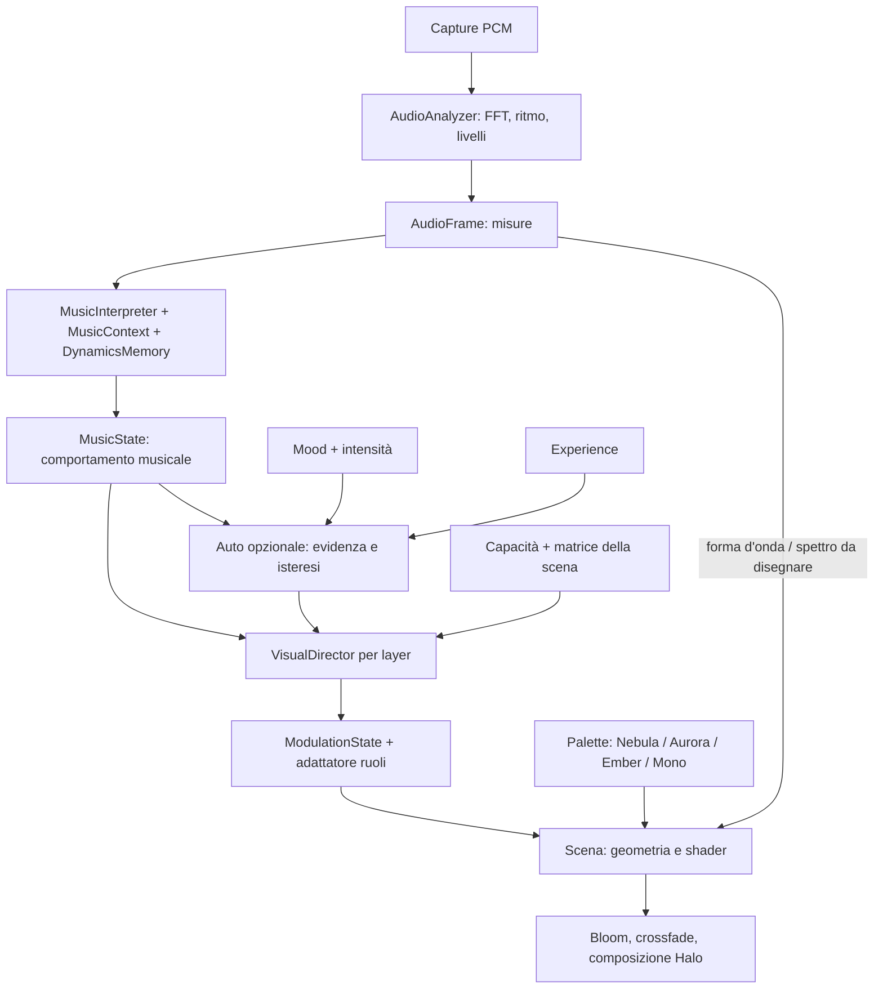

# Music Intelligence e Visual Director

> Documento di una fase precedente: misure e scelte sotto riportate appartengono alla data della verifica.
> Per la pipeline attuale (Rust/WASM, Timing, ShowDirector, Rig e moduli estratti) leggere
> [README](../README.md) e [scheda tecnica](technical-overview.md).

## Audit e scelte

La cattura resta in `audio/capture` (provider microfono browser/sintetico e Channel PCM Tauri; i file sono stati rimossi: solo audio dal vivo), `native/audio-capture` (cpal, selezione monitor/loopback) e `src-tauri/src/audio.rs`. `AudioEngine` legge una sola finestra PCM per frame: ultimi 2048 campioni per FFT, 4096 per voci/YIN. `AudioAnalyzer` e `BeatDetector` restano gli unici proprietari dell'analisi.

Prima del refactor, `VisualResponse` e `MusicContext` fornivano già presenza, audibilità, ruoli, sezioni, clock e memoria delle voci. Ora quell'implementazione si chiama `MusicInterpreter`; `VisualResponse` resta un alias compatibile. Non esistono due interpreti. Il vecchio contratto a quattro argomenti delle scene rimane valido; il quinto argomento opzionale introduce la modulazione. I preset JSON continuano a contenere geometria/camera/bloom, le palette conservano i colori.

`RenderEngine.Layer` mantiene target, pass, scena e un Director separato: durante un crossfade entrambe le scene leggono lo stesso MusicState e hanno inviluppi indipendenti. Il registry continua a scoprire `visualizers/*/index.ts`. UI e persistenza restano DOM vanilla e `settingsStore`, fullscreen resta in `platform/index.ts`.

## Pipeline

| Concetto | Responsabilità |
|---|---|
| AudioFrame | Misure: livelli, RMS, bande, FFT, flatness, flux, tempo, pitch, centroide/rolloff/spread in Hz |
| MusicState | Presenza, attività delle bande, transitori, intensità, calore, luminosità, dinamica e contesto temporale |
| Mood | Carattere: fluidità/aggressività, deformazione, persistenza, sensibilità delle bande, contrasto |
| Experience | Presentazione: velocità di risposta, camera/profondità, microeventi o struttura |
| VisualDirector | Traduzione centralizzata con matrice, capacità, limiti e inviluppi |
| Scene | Unità grafiche, uniform, geometria, texture della voce e memoria visiva |

MusicState estende i ruoli esistenti senza copiarli: `weight/flow/detail` sono attività delle regioni, `music` contiene clock, build/drop, trend e memoria a lungo termine. `intensity`, `brightness`, `warmth`, `transient`, `rhythmicConfidence`, `beatPhase`, `shortEnergy`, `energyDelta`, `dynamicRange`, `attack`, `decay` espongono la semantica comune. I valori sono 0–1 salvo i trend/delta firmati. Non sono probabilità né etichette di genere.

## Analisi e memoria

- **Spettro fisico:** centroide e deviazione standard pesati per potenza, rolloff all'85% su 20 Hz–16 kHz, prima del tilt e dell'AGC dello spettro grafico. Una sola FFT, due piccoli passaggi sui magnitudes già disponibili. Il centroide normalizzato in scala log sostituisce il precedente centroide dello spettro grafico in MusicContext.
- **Flux:** restano i tre transitori adattivi per regione; transient musicale usa anche medi e alti, non solo kick. Flatness e distribuzione delle bande conservano il comportamento già verificato.
- **Dinamica:** RMS fisico; loudness assoluta per memoria istantanea 40 ms, breve 600 ms e estremi con ritorno di 12 s. Delta = differenza istante/breve, attack/decay ne separano il segno. Il range non è una misura standardizzata LUFS/DR.
- **Sezioni:** restano EMA 1,5/6 s, build/drop conservativi, picco recente 20 s, drop recente 12 s e stile voci 20 s. Non vengono inventate etichette Intro/Verse/Outro.
- **Ritmo:** beatPhase deriva dal clock continuo di MusicContext con correzione graduale; la pulsazione del Director è pesata per confidence e audibilità. Senza aggancio rimangono dinamica, forma delle voci, apertura e attività spettrale. Il clock non implica un metro 4/4 riconosciuto.

## Mood e modalità

L'intensità del mood interpola ogni moltiplicatore da neutro (0) al carattere pieno (1). Cambiare scelta interpola il carattere in circa 2 s; non ricrea risorse GPU.

| Mood | Carattere principale |
|---|---|
| Euphoria | Espansione, luce, particelle e apertura |
| Dream | Fluidità, lentezza, persistenza |
| Dark | Contrasto, bassi, profondità e contenimento |
| Pulse | Bassi, risposta ritmica, memoria breve |
| Chaos | Turbolenza, deformazione, movimento e transitori |
| Ethereal | Spazio, bloom, persistenza e leggerezza |
| Melancholy | Medi, moto raccolto, memoria e sezioni |
| Focus | Camera ferma, dettagli contenuti, forma leggibile |

| Experience | Presentazione |
|---|---|
| Ambient | Attacco lento, reazioni sottili, memoria lunga |
| Immersive | Profondità, camera e particelle; non forza il fullscreen |
| Reactive | Attacco rapido e bande differenziate |
| Cinematic | Evoluzione lenta, tensione/rilascio, meno microturbolenza |
| Minimal | Presenza e dinamica generano la forma; in silenzio scena e ambiente sfumano verso il nero |

Le palette sono indipendenti; un mood non ricolora la scena. Focus / Reactive con intensità 0,65 è il default per le preferenze precedenti. Le nuove preferenze vengono validate al caricamento.

## Matrice e continuità

Le route sono piccoli record `{ source, target, amount }`. Una scena può sostituire tutte le route di un target; gli altri target conservano quelle comuni. Le sensibilità delle bande e i guadagni dei target dipendono anche da mood e modalità. I risultati sono limitati a 0–1 e filtrati con attack/release separati: impatto 6/180 ms di base, camera 1,8/3 s, profondità 3/5 s. Mood e Experience modulano questi tempi.

Le capacità non dichiarate sono disabilitate. La UI non mostra target non supportati né DSP. L'adattatore dei vecchi ruoli è un oggetto stabile separato con un proprio contenitore `music`: non scrive nello stato musicale e condivide solo array di sola lettura. Le scene mantengono i campionamenti locali dello spettro/voce necessari a disegnare forme.

| Scena migrata | Applicazione della direzione |
|---|---|
| Galaxy (prima integrazione) | Rotazione, deformazione bracci/core, emissione stellare via shader, profondità/camera, memoria onde |
| Tunnel | Deformazione delle pareti, apertura, turbolenza, scintille, camera/FOV e memoria |
| Particle Field | Emissione, deformazione, dispersione, rotazione, camera e profondità |
| Liquid | Deformazione delle voci, turbolenza, correnti, fosfori quando disponibili |
| Spectrum | Scala del core, deformazione lead, rotazione e durata degli echi |
| Oscilloscope | Ampiezze/forma dei canali e durata del fosforo |

Bloom e contrasto vengono diretti dal renderer; i limiti di qualità restano vincolanti. Minimal agisce anche sul fondo Halo, così il silenzio non lascia un cielo animato indipendente dal suono.

## Auto e UI

Core → **Direction** → **Mood / Experience / Auto / Quality**. Le scelte manuali di Mood o Experience disattivano Auto. Settings contiene Mood intensity. Scene, Audio, Palette, Settings e Fullscreen restano nel primo anello. Il sottomenu Mood ha otto elementi; il primo anello ne mantiene sei. Navigazione con frecce, Home/End e ritorno dal core, stato ARIA aggiornato.

Auto osserva comportamento: ritmo affidabile e percussione → Pulse/Reactive; calma tonale senza ritmo → Dream/Ambient; build sostenuto → Dark/Cinematic. Serve confidence >0,65, almeno 6 s di evidenza coerente e almeno 20 s fra decisioni. Le scelte vengono interpolate dal Director. Silenzio e incertezza mantengono la direzione, senza cambiare scena o sovrascrivere le preferenze manuali. Un cambio sorgente azzera l'evidenza.

## Estendere

1. **Mood:** aggiungere l'id in `director/types.ts` e una definizione in `director/profiles.ts`. Partire da `NEUTRAL`, cambiare solo le proprietà significative. Compare automaticamente nel ring; oltre gli otto mood iniziali valutare paginazione/spaziatura.
2. **Experience:** aggiungere id e definizione nella stessa coppia di file. Definire moltiplicatori, attack/release e gate Minimal. Nessun nuovo ramo nelle scene.
3. **Scena:** seguire README; dichiarare `direction.capabilities` in `index.ts` e consumare il quinto parametro opzionale `ModulationState` in `update`. Convertire 0–1 in unità della scena. Non ricomputare FFT, presenza o classificazioni musicali. Lasciare un fallback per gli host a quattro argomenti.
4. **Mapping:** aggiungere route in `direction.mappings`, oppure in `DEFAULT_ROUTES` per un default comune. Un target custom sostituisce le sue route predefinite, non si somma accidentalmente ad esse. Per una nuova feature aggiungere la misura/interpretazione una sola volta a monte e un test deterministico.

## Prestazioni e verifica

Oggetti e buffer persistono fra frame. Nessuna dipendenza aggiunta, nessuna FFT duplicata, nessuna UI aggiornata a frequenza audio. I profili sono lookup statici; route compilate al mount. Particelle Galaxy attenuate per seed nello shader senza rigenerare geometria. Debug solo DEV, spento normalmente (`?debug` o Shift+D), ora mostra misure Hz, dinamica, scelte effettive e output del Director.

Auto quality riduce prima solo la risoluzione (1 → 0,85), poi densità/risoluzione Medium, poi bloom/risoluzione, infine Low. Gli step di sola risoluzione non rimontano la scena. Recupero di un passo dopo almeno 30 s ≥58 fps e cooldown 60 s; regressione dopo 3 s <51 fps. Rimane una stima da RAF, non un timer GPU; i pass costosi non hanno ancora risoluzione indipendente.

`npm run check` verifica tipi, lint, test e build. Test nuovi in `director/VisualDirector.test.ts`, `audio/interpretation/Intelligence.test.ts`, `renderer/quality.test.ts`: normalizzazione, interpolazione, attacco/rilascio, route/capacità, immutabilità dell'input, Dream vs Chaos, silenzio Minimal, isteresi Auto, centroide/spread/rolloff con PCM, rumore/impulso/quieto/forte, dinamica e continuità della fase. Restano i test precedenti su beat/bande/presenza, sezioni, fade/tagli e grammatica delle sei scene.

Limiti: l'interprete non riconosce genere, strumenti separati o forma-canzone; BPM resta dipendente dagli onset bassi, ma non governa da solo il movimento. La voce reale resta il limite delle forme sintetiche (mix polifonici complessi possono ridurne la clarity). Il percorso di compatibilità mantiene parte dei nomi storici e del mapping grafico locale. La prossima iterazione dovrebbe tarare percettivamente i profili su registrazioni reali di ambient, classica, jazz, metal e musica elettronica, poi misurare costo GPU per pass su WebView2/Windows.

## File del refactor

Creati:

- `src/audio/analysis/SpectralFeatures.ts`
- `src/audio/interpretation/MusicInterpreter.ts`, `DynamicsMemory.ts`, `Intelligence.test.ts`
- `src/director/types.ts`, `profiles.ts`, `VisualDirector.ts`, `AutoDirection.ts`, `VisualDirector.test.ts`
- `src/renderer/quality.test.ts`
- `docs/visual-director.md`

Aggiornati:

- `README.md`, `src/types/audio.ts`, `src/types/visualizer.ts`
- `src/audio/AudioEngine.ts`, `src/audio/analysis/AudioAnalyzer.ts`
- `src/audio/visual-response/VisualResponse.ts`, `VisualResponse.test.ts`, `MusicContext.ts`
- `src/renderer/RenderEngine.ts`, `compositeShader.ts`, `quality.ts`
- `src/app/App.ts`, `src/app/debug/DebugOverlay.ts`, `src/stores/settingsStore.ts`
- `src/ui/Dial.ts`, `SettingsPanel.ts`, `icons.ts`
- `index.ts` e il rispettivo `*Visualizer.ts` in ciascuna delle cartelle `galaxy`, `tunnel`, `particle-field`, `liquid`, `spectrum`, `oscilloscope`.

Le modifiche precedenti a sezioni, segnali di prova, tracce e relativi test sono conservate. Backend Rust, palette e dipendenze non richiedono modifiche per questo refactor.

## Esito della verifica — 1 ottobre 2026

- `npm run check`: **74 test / 11 file**, typecheck, lint e build riusciti; 16 test aggiunti da questo refactor. Build e lint ricontrollati dopo gli ultimi aggiustamenti.
- `cargo check --workspace --offline`: riuscito con il sysroot di sviluppo locale. Nessuna prova di cattura WASAPI reale su Windows in questa sessione.
- Chromium, 1280×720, DPR 1, ANGLE / Mesa Intel UHD: **24 casi** (6 scene × Dream/Ambient, Chaos/Reactive, Dark/Minimal sonoro e silenzioso), nessun errore JavaScript/GLSL. Navigazione del nuovo ring, ARIA e persistenza dopo reload verificate.
- Galaxy a parità di snapshot musicale: distortion 0,25 → 1 e rotation 0,07 → 1 passando Dream/Ambient → Chaos/Reactive; persistence 0,97 → 0,34. Silenzio Minimal: visibility 0 e composizione sfumata al nero.
- Prova RAF con audio sintetico live, riflesso attivo e Chaos/Immersive, tutte le scene: circa **60 fps Low**, **41–50 Medium**, **27–35 High** nelle condizioni della macchina durante questa sessione. Sono campioni brevi (90 frame dopo 3 s di riscaldamento), non una garanzia su altri sistemi.
- Confronto nello stesso browser su Galaxy/Liquid, Director attivo/disattivato: update CPU di Director+scena mediamente 0,16–0,27 ms contro 0,12–0,15 ms del percorso compatibile. Disattivarlo non ripristina 60 fps High. Il confronto isola la direzione, non costituisce un benchmark completo della versione precedente; il costo del rendering va misurato separatamente su WebView2.

Artefatti locali non versionati: `/tmp/halo-direction/browser.json`, `performance.json`, `compare.json` e screenshot. La prossima verifica percettiva deve usare brani reali e la cattura Windows, includendo fade/tagli, passaggi quieti e musica priva di kick regolare.
